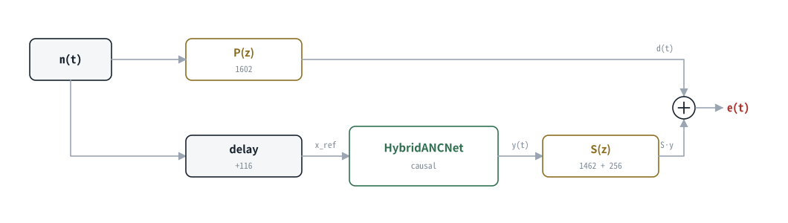
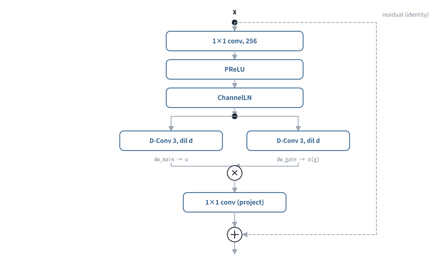
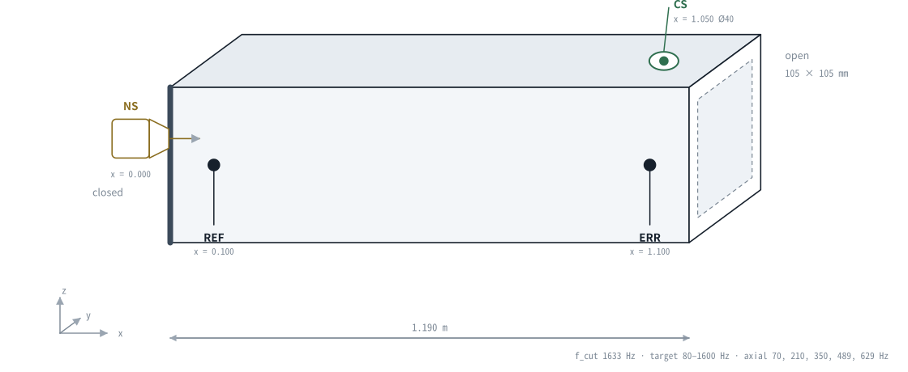
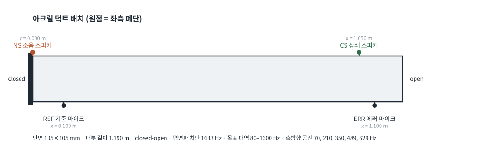

<div align="center">
  

# Deep ANC

**덕트용 인과(causal) 딥러닝 능동소음제어 — Elice A100 학습, Jetson AGX Orin 실시간 추론**

[](pyproject.toml)
[](requirements-train.txt)
[](docs/06_deployment_jetson.md)

</div>

> 1.2m 사각 아크릴 덕트 안에 quiet zone을 만든다. 48kHz 오디오를 256샘플 블록으로 받아
> **상쇄 파형을 직접 예측**하고, 학습 중에는 측정된 2차경로 `S(z)`를 미분 가능한 플랜트로
> 통과시켜 에러 마이크의 잔여 신호를 최소화한다.

진행 상황·실행 중인 학습·하드웨어 상태는 이 문서가 아니라 **[HANDOFF.md](HANDOFF.md)** 가
단일 출처다. 이 README는 프로젝트가 무엇이고 어떻게 쓰는지만 다룬다.

---

## 1. 프로젝트 개요

### 1.1 절대 목표

모든 데이터·모델·평가 결정은 다음 두 가지로 소급 판단한다.

| 목표 | 통과 기준 | 측정 축 |
|---|---|---|
| **기능 1 — 저주파와 고주파를 모두 제거** | 한쪽 대역만 좋으면 실패 | 옥타브밴드별 감쇠, 최악 10% 구간 |
| **기능 2 — 모든 소리를 제거 (quiet zone)** | 소음뿐 아니라 대화·음악도 감쇠 | 소스 종류별 감쇠의 **최악값**(평균 아님) |

기능 2가 평균이 아니라 최악값 문제인 이유: 여섯 소스 중 다섯이 −20dB이고 하나가 0dB이면
평균은 좋아 보이지만, 그 하나가 들리는 순간 quiet zone은 실패한 것이다.

판정 기준의 단일 출처는
[평가 프로토콜 §0](docs/07_evaluation_protocol.md#0-절대-목표-2가지와-측정-매핑)이다.

### 1.2 3단계 로드맵

| 단계 | 내용 | 재학습 |
|---|---|:---:|
| **Stage-1** | 합성 데이터 + surrogate 플랜트로 선형 역매핑 사전학습 | 진행 중 |
| **Stage-2** | 실측 `P(z)`/`S(z)` + recorded 세션 70%로 open-loop 파인튜닝 | 필요 |
| **Stage-3** | ERR 되먹임 closed-loop, 비선형 커리큘럼, THD/IMD 반영 | 필요 |

Stage-1이 먼저 선형 역매핑만 확립하는 이유는 [3.3](#33-학습-목표와-trusted-band)에 있다.
v1.1/v2 연구 항목은 [docs/11](docs/11_v2_roadmap.md)에 승인·기각 근거와 함께 있다.

### 1.3 검증된 것과 아직 아닌 것

| 항목 | 결과 | 상태 |
|---|---|:---:|
| 자동 회귀 테스트 | **604개** (인과성·등가성·DSP·데이터·게이트 실패증명) | 통과 |
| 오프라인↔스트리밍 수치 등가성 | 최대 오차 약 `3e-8` | 통과 |
| PyTorch↔ONNX Runtime 등가성 | 최대 오차 `8e-8` 이하 | 통과 |
| tiny + ORT CPU P99 | **1.44ms** (MAXN) / **1.54ms** (30W) / 게이트 `<3ms` | 통과 |
| base + ORT CPU P99 | 6.40ms / 게이트 미달 | 미달 |
| TensorRT FP16 (tiny) | P50 **0.29ms** (MAXN) / P99 3.12ms — **듀티 100% 벤치** | 잠정 |
| 실시간 구동 (RT 우선순위 적용 후) | xrun 145 → **2** / 20초, step 1.8–2.5ms | 통과 |
| **실측 `P/S` (G1)** | **저장 캡처 재분석으로 재발행** (스피커 0회) — 150–1600Hz 일관성 **P 0.9993 / S 0.9990**, P−S 상대 τ spread **1샘플** | 통과 |
| **실기 ANC 저역** (150–600Hz 측정, tiny) | tone300 **+6.26dB** · band **+5.14dB** · 음성+소음 **+4.39dB** | 동작 |
| **실기 ANC 고역** | 1150–1250Hz는 +0.46dB 지만 **2–8kHz 옥타브를 15–22dB 증폭** | **절대 목표 1 위반** |
| recorded 독립 세션 (G2) | 80세션 중 **47개만 시간축 복구**, 33개는 재녹음 필요 (형식 QA 는 80/80 이었다) | **FAIL** — 시간축 붕괴 |
| **파인튜닝 진입 게이트** | 당시 9개 전부 PASS — **그런데 플랜트가 틀렸고 데이터가 깨져 있었다** | **무효** |
| **Stage-2 파인튜닝** (tiny, 50k step) | 완주. val trusted **−0.07 dB** (cluster bootstrap CI [−0.456, +0.481] — 0과 구별 불가) | 완료 |
| **G4 독립 평가** | 최악 계열 `music` **val +0.58 / test +0.90 dB**, fullband val +0.07 | **FAIL** |
| 실제 덕트 감쇠 성능 | G4 FAIL — **배포 자격 없음** | **미주장** |

실기 ANC 수치는 `secondary_surrogate` checkpoint를 실기에 걸었을 때의 **관측치**다.
재현 절차와 원자료는 [6.6.3](#663-자동-offonoff-평가)과
`results/session_*/{metrics.csv, wav/}`에 있다.

> [!CAUTION]
> **"진입 게이트 9개 전부 PASS" 는 아무것도 보증하지 못했다.** 게이트가 전부 초록불인
> 상태에서 (a) 학습에 쓴 `S(z)` 의 형상이 **54% 틀려 있었고**(§7.5), (b) 파인튜닝 데이터
> 80세션의 재생↔녹음 시간축이 **붕괴해 있었으며**(§4.2), (c) 모델은 신뢰대역 밖
> 2–8 kHz 를 **15–22 dB 증폭**하고 있었다(§2.6). 이 셋 중 어느 것도 게이트가 보지 않았다.
> **게이트가 초록불이라는 사실은 검증이 아니라 게이트의 시야에 대한 진술일 뿐이다.**

고역 항목은 예전에 "아무 일도 일어나지 않아서 미달"로 적혀 있었다. **그 서술은 틀렸다.**
좁은 1150–1250 Hz 대역만 보면 +0.46 dB 로 0 dB 근처인 것이 맞지만, 옥타브밴드로 보면
같은 세션이 2–8 kHz 를 크게 **증폭**한다 — tone300 에서 2k **−15.42** / 4k **−18.03** /
8k **−21.56** dB(음수 = 증폭, `results/session_20260804_0939/metrics.csv`). 절대 목표 1
기준으로 이것은 미달이 아니라 **위반**이다. 원인은 용량이 아니라 손실에 대역 밖
do-no-harm 항이 없다는 것이다(§2.6, §7.7).

> 추론 지연 통과는 실시간 실행 가능성을 뜻할 뿐 감쇠 성능을 뜻하지 않는다.
> 학습 로그의 NMSE는 `secondary_surrogate` 플랜트에서 나온 **표현 사전학습 지표**이며
> 물리 성능이 아니다. 이 구분은 checkpoint의 `physics_status` 필드가 강제한다.

### 1.4 실기 동작 — 소음 10초 뒤 ANC ON

<div align="center">
  
</div>

음성과 80–800Hz 덕트 소음을 섞어 재생하고 10초 뒤 ANC를 켠 실측이다. 에러 마이크 레벨이
`−14.5 → −18.7 dBFS`로 내려가고, 스펙트럼에서 150–600Hz 공진 봉우리가 눌린다.
**이 시나리오(voice_in_noise)에서만** 1kHz 위가 −1.0 ~ −1.5 dB 로 거의 변하지 않는다.

> [!CAUTION]
> **다른 시나리오에서는 그렇지 않다 — 이것이 현재 가장 큰 결함이다.** 같은 모델·같은
> 설정으로 잰 `results/session_20260804_0939/metrics.csv` 는 대역 밖을 크게 **증폭**한다
> (음수 = 증폭): tone300 이 1k **−16.84** / 2k **−15.42** / 4k **−18.03** / 8k **−21.56** dB,
> multitone 이 2k **−16.88** / 4k **−17.36** / 8k **−17.96** dB.
> 손실에 대역 밖 do-no-harm 항이 **없고 게이트에만 있기 때문**이다.
> **절대 목표 1(저·고역 모두 제거) 위반이며, "증폭하지 않는 것" 조차 지키지 못하고 있다.**
> 위 그림 한 장으로는 이 문제가 보이지 않는다 — 그림의 시나리오가 6개 중 유일하게
> 무해한 것이기 때문이다.

> 이 그림은 `results/session_*/`의 실제 WAV와 `metrics.csv`에서
> [render_readme_figures.py](scripts/docs/render_readme_figures.py)가 다시 만든다.
> 손으로 그린 그림이 아니라서 수치가 바뀌면 그림도 바뀐다.


---

## 2. 아키텍처

### 2.1 신호 흐름

<div align="center">
  
</div>

<p align="center"><b>Figure 1.</b> 학습과 실기가 같은 방정식을 쓴다. 모델은 마스크가 아니라
<b>상쇄 파형 <code>y(t)</code> 를 직접 회귀</b>하고, 학습에서는 실측 <code>S(z)</code> 를
미분 가능한 플랜트로 통과시켜 에러 마이크의 <code>e(t)</code> 를 최소화한다.
숫자는 실측값(48kHz 샘플)이며 <code>configs/duct.yaml</code> 이 단일 출처다.</p>

```
e(t) = d(t) + S · y(t)          d(t) = P · n(t)
```

측정 FIR에 극성이 이미 들어 있으므로 어디에서도 추가 부호 반전을 하지 않는다.

**지연 예산이 이 설계의 모든 것을 결정한다.** 상쇄 경로는 `S 1462 + handoff 256 = 1718`
샘플이고 1차 경로는 `P 1602` 샘플이다. 즉 **상쇄음이 소음보다 116샘플 늦게 도착한다.**
소음을 Jetson이 직접 생성하기 때문에 레퍼런스를 그만큼 미리 줄 수 있고
(`digital_reference_lead_samples = 116`), 그래서 이 시스템이 성립한다.
이 여유가 **2.4 ms 뿐**이라는 사실이 아래 §2.3의 모든 설계 결정을 강제한다.

> **절대 지연(1602 / 1462)은 재현되지 않는다 — `P − S = 140` 만이 물리 불변량이다.**
> 독립 캡처 9건에서 P−S 는 139~141, lead 는 115~117(중앙 **116**)로 재현되지만, 절대
> 지연은 low-latency 캡처에서 1565~1659, high-latency 에서 2858~2888 로 흩어진다
> (캡처별 타임베이스 드리프트 364~729 ppm + 앵커 반복 선택 의존). 그래서 `P` 와 `S` 는
> 반드시 **같은 캡처·같은 앵커**의 값을 함께 써야 하고, 아티팩트에 `capture_id` ·
> `anchor_repeat` · `kept_repeat_indices` 가 박혀 있다(§7.5).

### 2.2 HybridANCNet

<div align="center">
  
</div>

<p align="center"><b>Figure 2.</b> 전체 스택 (tiny 기준). 오른쪽은 텐서 shape.
점선 블록(MHSA)은 <code>base</code> 전용이며 배포 모델에는 없다 —
구조 탐색에서 <b>측정으로 실격</b>했다(§2.8).</p>

| 하이퍼파라미터 | `base` | `tiny` |
|---|---:|---:|
| 파라미터 | 5,994,512 | **1,164,809** |
| encoder channels `C` | 256 | 128 |
| TCN repeats × dilations | 3 × (1,2,4,8,16) | 2 × (1,2,4,8) |
| TCN blocks | 15 | 8 |
| TCN hidden | 512 | 256 |
| GLSTM `G × H` | 2 × 256 | 1 × 192 |
| MHSA | 4 heads, w=64 | 없음 |
| 수용영역 | 504 ms | 168 ms |
| **Jetson P99 (ORT CPU)** | 6.8 ms ✗ | **1.84 ms** ✓ |
| Jetson P99 (TRT FP16) | 10.14 ms ✗ | 7.66 ms ✗ |

`hop=128`인데 런타임 블록이 256인 것은 실수가 아니다. 엔진은 한 스텝에 **2프레임을 그래프
내부에서 언롤**한다 — 콜백 주기를 늘려 xrun 여유를 얻으면서 알고리즘 룩어헤드는 0으로 유지한다.

### 2.3 왜 원논문 구조를 그대로 쓰지 않는가

이 아키텍처는 세 논문에서 부품을 가져왔지만 **어느 것도 그대로 쓸 수 없었다.** 원논문들은
전부 오프라인·비인과 또는 자기회귀 설정이고, ANC는 그 반대편 극단에 있기 때문이다.

| 제약 | 값 | 이 제약이 배제하는 것 |
|---|---|---|
| 알고리즘 룩어헤드 | **0 프레임** | 양방향 RNN, global LN, STFT 분석창 |
| 실시간 예산 | Jetson CPU P99 **< 3 ms** / 5.33 ms 블록 | 자기회귀 샘플 생성, 5.99M 파라미터 |
| 스트리밍 = 오프라인 등가 | 최대 오차 `3e-8` | 그래프에 숨은 전역 상태 |
| 출력 | 마스크가 아니라 **파형** | 마스킹 기반 분리 formulation |

#### Conv-TasNet — encoder/decoder와 1-D 블록

**가져온 것:** 파형영역 학습형 encoder/decoder, depthwise dilated conv 블록, residual 연결.
(원구조의 **skip 누적 분기는 가져오지 않았다** — 블록 출력은 residual 하나다.)

**바꾼 것과 이유:**

1. **global LN → ChannelLN.** Conv-TasNet의 gLN은 발화 **전체**의 통계로 정규화한다. 스트리밍에서
   그 통계는 미래를 포함하므로 인과성이 깨진다. 채널 축만 정규화해야 프레임 단위 추론과
   오프라인 결과가 수치로 같아진다 — 이 등가성을 테스트가 강제한다.
2. **마스크 → 파형 회귀.** Conv-TasNet은 혼합 신호의 encoding에 마스크를 곱해 화자를 분리한다.
   ANC에는 **분리할 혼합 신호가 없다.** 레퍼런스에 마스크를 곱해서는 1차경로 응답의
   *음의 신호*를 만들 수 없다. 그래서 디코더가 상쇄 파형을 직접 합성한다.
3. **좌측 패딩 전용.** 원구조는 기본이 비인과다.

> 그대로 썼다면: 실시간에서 소음이 도착하기 **전에** 출력을 낼 수 없어 ANC 자체가 불가능하다.

#### WaveNet — dilated causal convolution

**가져온 것:** dilation을 지수적으로 키워 수용영역을 넓히는 스택, gated activation(GLU).
(**skip 누적은 쓰지 않는다** — `hybrid_anc.py` 의 본체 루프는 `h = block(h)` 단일 체인이다.)

<div align="center">
  
</div>

<p align="center"><b>Figure 3.</b> tiny의 한 repeat (d = 1, 2, 4, 8). 층을 쌓을 때마다 수용영역이
지수적으로 커지지만 현재 프레임 <code>t</code> 오른쪽 탭은 하나도 없다.
전체 2 repeat = 61 프레임 = <b>168 ms</b>.</p>

**바꾼 것과 이유:**

1. **자기회귀 제거.** WaveNet은 샘플 하나를 낼 때마다 스택 전체를 다시 통과한다. 48 kHz에서
   5.33 ms 블록당 **256회 forward**가 필요하다. Jetson CPU 예산은 블록당 **1회 3 ms**다.
   여기서는 레퍼런스로부터 프레임 전체를 한 번에 예측한다(비자기회귀).
2. **μ-law softmax → 연속 출력.** 상쇄 파형은 8-bit 양자화 격자 위에 있지 않다.
3. **샘플이 아니라 encoder 프레임 위에서 dilation.** hop 128 덕분에 같은 dilation 예산
   (1,2,4,8)이 몇 ms가 아니라 **168 ms**를 덮는다. 덕트의 최저 축방향 공진 70 Hz의
   주기가 14 ms이므로 이 길이가 필요하다.

> 그대로 썼다면: 실시간 추론이 100배 이상 예산을 초과한다.

#### GCRN — Grouped LSTM

**가져온 것:** 채널을 G그룹으로 나눠 순환 비용을 1/G로 줄이고, 그룹 간 셔플로 정보를 다시 섞는 전략.

<div align="center">
  
</div>

<p align="center"><b>Figure 4.</b> Grouped LSTM (G = 2 예시). <code>h, c</code> 가 프레임 간에
넘어가는 순환 상태이며, 이것이 곧 스트리밍 상태의 실체다(Figure 6).</p>

**바꾼 것과 이유:**

- **STFT 도메인 → 파형 도메인.** GCRN은 복소 스펙트럼 매핑 모델이라 LSTM이 STFT 병목에 있다.
  STFT는 **분석창을 다 채워야** 변환할 수 있으므로 창 길이만큼 룩어헤드가 생긴다.
  1024샘플 창이면 **21 ms**인데, 이 시스템의 전체 여유는 **2.4 ms**다.
  **STFT 기반 구조는 지연 예산만으로 배제된다.** 그래서 그룹 LSTM만 떼어내 TCN 스택
  중간(repeat 2 뒤)에 넣었다.

#### Transformer — Multi-Head Self-Attention

**가져온 것:** 회전기계처럼 반복되는 패턴을 되돌아보는 조회 메커니즘.

**바꾼 것:** 양방향 full attention → **windowed causal** (과거 64프레임 = 170 ms).
양방향은 비인과라 즉시 탈락이고, `O(T²)` full attention은 스트리밍에서 무한히 커진다.

**그리고 측정 결과 도움이 되지 않았다.** 20k step 동일 조건 구조 탐색에서 attention 계열은
대조군 대비 **fullband +2.15 dB / held-out +2.12 dB 악화**로 do-no-harm 실격이었다.
배포 모델 `tiny`에서 MHSA를 **제거**한 근거가 이 측정이다. 논문에 있는 부품이라고 넣지 않았다.

#### 정리

| 논문 | 가져온 것 | 그대로 쓰면 | 이 프로젝트 |
|---|---|---|---|
| Conv-TasNet | 파형 encoder/decoder, 1-D 블록 | 비인과(gLN), 마스크 formulation | cLN, 파형 직접 회귀, 좌측 패딩 |
| WaveNet | dilated causal 스택 | 자기회귀 → 예산 100배 초과 | 비자기회귀, 연속출력, 프레임 단위 dilation |
| GCRN | grouped LSTM + shuffle | STFT 창 21 ms 룩어헤드 | 파형영역 TCN 스택 안에 배치 |
| Transformer | 반복 패턴 조회 | 양방향·`O(T²)` | windowed causal — **측정 후 제거** |

### 2.4 TCN 잔차 블록

<div align="center">
  
</div>

<p align="center"><b>Figure 5.</b> 1×1로 채널을 넓히고 depthwise dilated conv <b>두 갈래</b>
(주경로 · 게이트)로 시간을 본 뒤 곱하고, 1×1로 되좁혀 <b>입력에 더한다</b> —
<code>return x + project(u · sigmoid(g))</code>. residual 하나뿐이고 <b>별도 skip 분기는 없다</b>
(<a href="src/deep_anc/models/tcn_blocks.py">tcn_blocks.py</a> <code>TCNBlock.forward</code>).
depthwise를 쓰면 채널마다 독립 시간 필터를 두면서도 파라미터가 <code>H·k</code> 로 끝나고,
채널 혼합은 앞뒤 1×1이 맡는다.</p>

### 2.5 스트리밍 상태

<div align="center">
  
</div>

<p align="center"><b>Figure 6.</b> 모든 상태를 그래프 입출력으로 드러낸다.
숨은 전역 상태를 두면 오프라인 결과와 프레임 단위 결과가 같은지 <b>검증할 방법이 없다.</b>
tiny의 상태는 12개다.</p>

- 오프라인 일괄 추론 ↔ 프레임 단위 스트리밍: 최대 오차 **3e-8**
- PyTorch ↔ ONNX Runtime: 최대 오차 **8e-8**
- ONNX opset 17, 정적 shape, 상태 명시 I/O

### 2.6 성능

**모든 수치는 `secondary_surrogate` 플랜트에서 나온 표현 사전학습 지표이거나 실기 관측치다.**
실측 `P/S` 파인튜닝 전이므로 최종 성능이 아니다. 이 구분은 checkpoint의 `physics_status`
필드가 강제한다.

**base vs tiny** — 동일 조건(100k step, 같은 seed·데이터, held-out 64 아이템).
**전부 `secondary_surrogate` 플랜트 + 당시 trusted 대역 150–600 Hz 기준의 사전학습 지표**이며
실제 덕트 감쇠가 아니다:

| 지표 (NMSE dB, 낮을수록 좋음) | base 5.99M | tiny 1.16M | 우세 |
|---|---:|---:|---|
| trusted 150–600 Hz | **−18.99** | −18.66 | base 0.33 |
| fullband | −15.88 | **−17.14** | **tiny 1.26** |
| held-out η=0.15 trusted | **−14.78** | −14.74 | base 0.04 |
| held-out η=0.15 fullband | −12.97 | **−13.97** | **tiny 1.00** |
| **최악 아이템 fullband** | **+13.89 (증폭)** | **+4.06** | **tiny 9.83** |
| Jetson P99 | 6.8 ms ✗ | **1.84 ms** ✓ | **tiny** |

소스별로는 **7종 중 7종 전부 tiny가 우세**하며, 최악 소스 `demand`가 base −4.36 / tiny −9.24 dB다.
**파라미터가 5배 많다고 안전하지 않다** — 최악 아이템에서 base는 fullband를 13.89 dB 증폭한다
(do-no-harm 위반). 배포 후보를 tiny로 확정한 근거다.

**구조 탐색** — 20k step 동일 예산, `last.pt` 기준, paired bootstrap 95% CI:

| 후보 | trusted NMSE | Δ vs 대조군 | 95% CI | 판정 |
|---|---:|---:|---|---|
| `tiny_control` | −14.59 | — | — | **승자** |
| `tiny_long` | −14.81 | −0.22 | [−0.71, **+0.26**] | 유의하지 않음 |
| `tiny_long_attn` | −12.42 | +2.17 | [+1.47, +2.94] | 실격 (do-no-harm) |
| `tiny_attn` | −12.06 | +2.53 | [+1.59, +3.53] | 실격 (do-no-harm) |

seed를 바꾸면 `tiny_long`의 Δ가 −0.22 ↔ +0.46으로 **0.68 dB 요동**한다. 판정 마진 0.30 dB보다
크므로 이득이 있더라도 run 간 잡음에 묻힌다. **구조 탐색은 종결이고 tiny를 유지한다.**

**GPU(TensorRT)는 typical latency 에서 2.5배 빠르고, CPU 는 꼬리가 더 촘촘하다.**
배포는 CPU 지만 GPU 가 못 하는 것이 아니다 — 둘의 성격이 다르다.

> [!WARNING]
> **아래 GPU 수치는 듀티 100%(연속 실행) 조건이다 — 실제 ANC 조건이 아니다.**
> [`measure_inference_latency.py`](scripts/bench/measure_inference_latency.py) 는 warmup 뒤
> `for i in range(steps)` 로 **sleep 없이 back-to-back** 추론을 돌린다. 이 부하가 GPU 를
> 최고 클록(1300 MHz)에 붙잡아 둔다. 실제 런타임은 hop 256 = **5.33 ms 주기에 추론
> ~0.3 ms → 듀티 약 6%** 라 거버너가 **306 MHz 로 고정**하고, 그 조건에서 `tiny` TRT P50 이
> **0.30 → 1.10 ms 로 3.7배** 나빠진다. CPU(ORT) 수치는 이 영향을 덜 받는다.
> **배포 판단은 주기 호출 벤치(5.33 ms 간격, sleep 포함)로 다시 해야 한다 — 그 벤치는
> 아직 저장소에 없다**(`--period-ms` 옵션 추가가 별건 과제다).

**전원 모드 30W** 기준 (MAXN 값은 [docs/12 §4.6](docs/12_system_summary.md#46-추론-지연--30w-vs-maxn)
이 단일 출처다. 전원모드를 함께 적지 않은 지연 수치는 인용하지 않는다):

| 모델 | 엔진 | P50 | P90 | P99 | max |
|---|---|---:|---:|---:|---:|
| **tiny** | **ORT CPU** | 1.38 | 1.44 | **1.54** | 46.1 |
| tiny | TRT FP16 | **0.56** | **1.27** | 3.27 | 47.1 |
| base | ORT CPU | 6.00 | 6.18 | 6.40 | 54.2 |
| base | TRT FP16 | **1.33** | 4.00 | 6.00 | 49.2 |

(RT 우선순위 `chrt -f 80`, 코어 4–7 고정, warmup 500, 5000 스텝.)

> [!IMPORTANT]
> **max 46–54 ms 는 "데스크톱 잡음" 이 아니라 커널 RT 스로틀링이다.** 이 Jetson 은
> `kernel.sched_rt_runtime_us = 950000`, `sched_rt_period_us = 1000000` 이라 SCHED_FIFO
> 태스크가 **1초 주기마다 정확히 50 ms 실행을 거부**당한다. 벤치 명령이 쓰는 `chrt -f 80`
> 이 곧 원인이며, `chrt` 를 떼면 이 스파이크는 사라진다.
> 확인: `cat /proc/sys/kernel/sched_rt_runtime_us /proc/sys/kernel/sched_rt_period_us`.
> 엔진 비교에 쓰지 않는 것은 맞지만, **실시간 런타임도 RT 우선순위로 도는 이상 같은
> 50 ms 정지를 겪는다** — hop 예산 5.33 ms 의 **9배**다. 벤치 아티팩트가 아니라 배포
> 전에 반드시 다뤄야 할 실제 결함이다.

읽는 법:

* **GPU 가 P50 에서 2.5배, P90 에서도 빠르다.** 뒤집히는 것은 P99 뿐이다.
* **base 는 GPU 에서만 돌아간다.** CPU 로는 중앙값 6.00 ms 로 5.33 ms 예산을 이미 넘어
  아예 따라가지 못한다. TRT 가 base 를 4.5배 빠르게 한다.
* 배포 모델 `tiny` 는 **CPU 를 쓴다.** 하드 마감에서 글리치를 만드는 것은 평균이 아니라
  꼬리이고, P99 1.54 vs 3.27 ms 로 CPU 가 2배 촘촘하다. 둘 다 5.33 ms 예산 안이지만
  안전 여유(게이트 P99 < 3 ms)를 넘는 쪽은 GPU 다.
* **모델을 키운다면 GPU 가 유일한 길이다.** 단 **고역은 용량 문제가 아니다** — 손실이
  trusted band 만 보고 대역 밖 do-no-harm 항이 손실에 없기 때문이다. 용량을 늘리면 오히려
  대역 밖 증폭이 커질 수 있다(`base` 는 최악 아이템 fullband 를 **+13.89 dB 증폭**했다).
  **손실 수정이 먼저다.**

이 수치는 엔진 구현을 고친 뒤의 것이다. 처음 측정에서는 GPU 가 P99 7.66 ms 로 CPU 보다
4배 나빴는데, **원인이 GPU 가 아니라 구현이었다.**

| 결함 | 고친 방식 | 효과 |
|---|---|---|
| CUDA Graph 미사용 | parity 별 그래프 캡처(H2D→추론→D2H 한 번에) | P50 1.32 → 0.56 ms |
| pageable 호스트 메모리 | `cudaHostAlloc` 고정 버퍼 | 비동기 복사가 실제로 비동기가 됨 |
| 매 스텝 `set_tensor_address` 26회 | A/B 두 경우를 그래프에 굳힘 | 파이썬 호출 제거 |
| 매 스텝 numpy 할당 | 고정 버퍼에 직접 기록 | 핫패스 할당 제거 |
| 동기 대기 정책 | `cudaDeviceScheduleSpin` | 스레드 재우기 방지 |

그래프 경로는 비그래프 경로와 **비트 단위로 동일**하다(최대오차 `0.000e+00`).

**GPU 는 폭(width)에는 거의 공짜지만 깊이(depth)에는 비싸다.** 지금까지의 구조 탐색은
깊이·수용영역·attention 만 바꿨고 **폭만 키운 변형은 시험하지 않았다.** 그런데 GPU 가
원하는 것은 정확히 폭이다 — 레이어당 병렬 작업이 늘어야 놀던 코어가 채워진다.
tiny 는 레이어당 병렬 작업이 약 512 개인데 Orin 은 CUDA 코어가 2048 개다.

| 모델 | 파라미터 | 블록 | GPU P50 | GPU P99 | CPU P50 |
|---|---:|---:|---:|---:|---:|
| `tiny` | 1.16M | 8 | 0.56 | 3.27 | 1.38 |
| `base` | 5.99M | **15** | 1.33 | 6.00 | 6.00 |
| `tiny_wide` | **12.8M** | 8 | **1.13** | **4.63** | 9.51 |

`tiny_wide` 는 `tiny` 보다 **11배 큰데 GPU 에서 2배만 느리고**, 파라미터가 2.1배 많은
`base` 보다도 **빠르다** — 블록이 8 대 15 이기 때문이다. 비용을 내는 것은 순차 커널
런치이지 연산량이 아니다.

연속 실행 조건에서 `tiny_wide` 는 GPU P99 4.63 ms 로 5.33 ms 예산 안이고 CPU 는 중앙값
9.51 ms 로 2배를 넘긴다. **다만 GPU 쪽 값은 듀티 100% 에서 잰 것이라 "실시간 가능" 판정으로
쓸 수 없다** — 듀티 6% 주기 호출 벤치가 선행되어야 한다.

> [!CAUTION]
> **용량이 병목이라는 증거는 없다. 한때 있다고 판단했으나 그 판단은 철회됐다.**
> 파인튜닝의 학습 NMSE 가 −2 dB 에서 정체한 것은 사실이지만, 원인은 용량이 아니라
> ① 학습 데이터의 입력–타깃 시간축 붕괴(§4.2)와 ② 33~54% 틀린 `S(z)`(§7.5)였다.
> 복구된 플랜트에서 FIR 길이를 512 → 8192 로 늘려도 이론 상한이 −3.87 → −4.16 dB 로만
> 움직인다 — **용량은 병목이 아니다.** `tiny_wide` 는 여전히 **지연 측정용 무작위
> 초기화**이며, 용량 실험은 재녹음 이후에 다시 물어야 한다.

**실기 ANC** (tiny + ONNX Runtime, 실제 덕트/마이크/스피커):

<div align="center">
  
</div>

<p align="center"><b>Figure 7.</b> 음성 + 80–800 Hz 덕트 소음을 재생하고 10초 뒤 ANC를 켠 실측.
에러 마이크 레벨 <code>−14.5 → −18.7 dBFS</code>, 150–600 Hz 공진 봉우리가 눌린다.</p>

| 시나리오 / 대역 | 감쇠 |
|---|---:|
| tone 300 Hz (trusted) | **+6.26 dB** |
| band (trusted) | **+5.14 dB** |
| 음성 + 소음 (80–800 Hz) | **+4.39 dB** |
| 1150–1250 Hz | +0.46 dB — 상쇄도 증폭도 하지 않음 |
| **2 kHz 옥타브** (tone300 / multitone) | **−15.42 / −16.88 dB — 증폭** |
| **4 kHz 옥타브** (tone300 / multitone) | **−18.03 / −17.36 dB — 증폭** |
| **8 kHz 옥타브** (tone300 / multitone) | **−21.56 / −17.96 dB — 증폭** |

좁은 1150–1250 Hz 대역만 보면 0 dB 근처지만, 옥타브밴드로 보면 **2–8 kHz 를 15–22 dB
증폭한다.** 손실이 trusted band 만 보고 **대역 밖 do-no-harm 항이 손실에 없기 때문**이다
(게이트에만 있다). 절대 목표 1 의 고역은 미달이 아니라 **역행**이며, "증폭하지 않는 0 dB"
조차 현재 달성하지 못한 상태다. **손실에 대역 밖 페널티를 넣기 전에는 어떤 고역 주장도
하지 않는다**(§7.7).

전 시나리오 옥타브밴드는 [docs/12 §4.7](docs/12_system_summary.md#47-실기-anc-사전학습-tiny--ort-cpu)에
표로 있다. 재현:

```bash
.venv/bin/python -c "
import csv
for r in csv.DictReader(open('results/session_20260804_0939/metrics.csv')):
    print(r['scenario'], [round(float(r[f'band_{b}_att_db']),2) for b in (1000,2000,4000,8000)])"
```

---

## 3. 덕트 구조와 동작 원리

### 3.0 덕트 물리

<div align="center">
  
</div>

<p align="center"><b>Figure 8.</b> 상쇄 스피커(CS)는 <b>상면 side-branch</b> 라 상쇄음이
축방향이 아니라 위에서 들어온다. 단면 105 mm 가 평면파 차단 1633 Hz 를 결정한다.
좌표·치수는 <code>configs/duct.yaml</code> 에서 읽어 그린다.</p>

<div align="center">
  
</div>

| 항목 | 값 | 의미 |
|---|---|---|
| 내부 길이 | 1.190 m (외형 1.200 m) | 좌측 폐단 내측면 ~ 개구 |
| 단면 | 105 × 105 mm 사각 (PMMA, 두께 10 mm) | — |
| 경계 | closed–open | 폐단 반사 0.80, 개방단 −0.45(위상 반전) |
| **평면파 차단** | **1,633 Hz** = `c / (2·0.105)` | 이 위는 단일 스피커·단일 마이크로 제어 불가 |
| 축방향 공진 | 70 / 210 / 350 / 489 / 629 Hz | `L_eff ≈ 1.226 m` (개방단 보정 `0.61·r_eq`) |
| 현실적 목표 대역 (`realistic_target_band_hz`) | **80–1600 Hz** | 차단 주파수와 스피커 저역 한계의 교집합. **2026-08-05 에 80–800 에서 확대** |
| **trusted band** | **150–1600 Hz** | 실측 `S(z)` `consistency_band_hz` ∩ 목표 대역 — 손실이 보는 대역 |
| **진짜 저역 한계** | **80–150 Hz** | 클린 재측정 후에도 S 부대역 일관성 **0.758** — 스피커 저역 SNR 한계 |

배치(원점 = 좌측 폐단): 소음 스피커 `x=0.0`(축방향 방사) · 기준 마이크 `x=0.100`(벽면) ·
상쇄 스피커 `x=1.050`(상면 side-branch, Ø40) · 에러 마이크 `x=1.100` · 개구 `x=1.200`.

> 에러 마이크의 `x=1.100`은 **잠정값**이다. 상쇄 스피커 마운트 구간(0.990–1.110)과 겹치는
> 문제가 미해결이라 확정 시 [duct.yaml](configs/duct.yaml)과 RIR 뱅크를 함께 갱신해야 한다.
> 도면과 위 표는 모두 `duct.yaml`에서 자동 생성된다 — 설정과 문서가 어긋날 수 없다.

### 3.1 지연 물리와 두 레퍼런스 모드

이 프로젝트의 심장은 지연 예산이다. 상쇄 신호는 소음보다 **먼저** 에러 마이크에 도달해야 한다.

<div align="center">
  
</div>

| 모드 | 레퍼런스 | 예측 부담 | 운용 범위 |
|---|---|---|---|
| **digital-ref** | Jetson이 소음원을 직접 생성 | 출력버퍼 지연이 양 경로에 공통 | 광대역 비정상 신호까지 상쇄 가능 |
| **acoustic-ref** | 외부 소음을 REF 마이크로 수음 | `P ≈ 30ms` 예측 필요 | 톤·회전기계·공진 등 주기/협대역 |

현재 기본은 digital-ref다. 자기 생성 소음을 실제 출력보다 앞서 공급하는 선행량이
`digital_reference_lead_samples`이며 실측 P/S에서 나온다.

```
lead = (S 순수지연 1462 + 스레드 핸드오프 256) − P 순수지연 1602 = 116
```

**학습 116 / 배포 109 로 지금은 다르다.** 배포 중인 ONNX는 실측 전에 `lead=109`(추정 P/S
기준)로 사전학습한 것이고, 런타임은 checkpoint·ONNX 메타와 설정이 **다르면 시작 전에
거부**하므로 그 모델에는 109가 맞다. 새 파인튜닝이 116으로 끝나면 `runtime_tiny.yaml`도
116으로 올린다. 두 값이 섞이지 않게 막는 것이 이 거부 규칙이다.

> **이력 주의.** 이 값은 세 번 바뀌었다 — 추정 `109`(순차 ESS, S 1342) → 오염된 인터리브
> 측정 `113`(S 1465 / P 1608) → **복구된 측정 `116`(S 1462 / P 1602)**. 문서에서 109 나
> 113 을 보면 낡은 판이다. 현행 값의 단일 출처는 `configs/duct.yaml` 과
> `assets/measured/*_il.npz` 이며, 재현은 다음 한 줄이다.
>
> ```bash
> .venv/bin/python -c "
> import numpy as np
> p=np.load('assets/measured/primary_path_il.npz'); s=np.load('assets/measured/secondary_path_il.npz')
> P,S=int(p['delay_samples']),int(s['delay_samples'])
> print('P',P,'S',S,'P-S',P-S,'lead',S+256-P)"
> # P 1602 S 1462 P-S 140 lead 116
> ```
>
> 이미 학습이 끝난 `runs/finetune_tiny` 는 **lead 113 / S 1465 플랜트**에서 나온 것이라
> 새 플랜트 기준으로 재평가하기 전에는 그 수치를 현재 플랜트 성능으로 인용할 수 없다.

acoustic 모드에서는 반드시 0으로 덮어써야 한다.

덕트 평면파 컷오프는 약 1,633Hz다. 그 이상은 단일 상쇄 스피커와 에러 마이크로 제어하기 어렵다.
acoustic-ref에서 예측 불가능한 광대역 성분은 제거가 아니라 **증폭하지 않는 0dB**가 성공 기준이다.
**현재는 그 기준조차 못 지킨다** — digital-ref 실기에서 2–8 kHz 를 15–22 dB 증폭한다(§2.6).
손실에 대역 밖 do-no-harm 항을 넣는 것이 선결 과제다.
자세한 지연 회계는 [docs/01](docs/01_physics_limits.md)을 따른다.

### 3.2 극성과 플랜트 규약

```
e = d + S·y        (측정 FIR에 극성이 이미 포함 — 어디에서도 추가 부호 반전 금지)
```

학습 플랜트의 총지연 = `S(z)` npz의 delay(1462) + 스레드 핸드오프(256). digital-ref의
`d` 경로에는 핸드오프가 없다. RIR에는 음향 온셋이 이미 포함돼 있어서 `D_noise` 결합 시
`t_ac(NS→ERR)`를 빼야 한다([synth_dataset.py](src/deep_anc/data/synth_dataset.py) 주석 참조).

### 3.3 학습 목표와 trusted band

손실은 **trusted band에서만** 최적화한다. trusted band는 `S(z)` 실측 유효대역
(`consistency_band_hz`)과 덕트 목표대역(`realistic_target_band_hz`)의 교집합이며
**2026-08-05 플랜트 복구 이후 150–1600 Hz** 다(이전 150–600 Hz).

대역이 넓을수록 좋은 것이 아니다. `S(z)`를 신뢰할 수 없는 대역까지 fullband로 최적화하면
그 대역의 잘못된 위상 정보가 gradient를 지배해 **신뢰 구간의 성능까지 잃는다**. 실제로 초기
학습은 fullband 목표에서 loss 2.0에 수렴했는데, 그것은 "출력 0"이 정확한 해였기 때문이다.
fullband NMSE도 함께 기록하되 최적화 대상으로 삼지 않는다.

같은 이유로 Stage-1은 공칭 플랜트를 고정한다. 모델 입력에 조건으로 주어지지 않는 랜덤
delay/all-pass 섭동은 위상 gradient를 상쇄해 다시 영출력 해로 몰고 간다.

> [!WARNING]
> **대역을 넓힌 것과 고역이 좋아지는 것은 다르다.** 결함 3(대역 밖 2–8 kHz 증폭)이 살아
> 있는 상태에서 손실 대역만 2.67배 넓히면 gradient 가 고역으로 쏠려 150–600 Hz 가
> 나빠질 수 있다. 순서는 **① 손실에 대역 밖 do-no-harm(악화 금지, 개선 무보상) 항 추가
> → ② 넓힌 대역으로 재학습** 이다. 이 순서를 코드로 강제하지는 못하고 있다(§7.7).

**손실 대역(optimize)과 보고 대역(measure)은 다른 것이다.** 손실 대역은 보수적이어야
하고, 보고 대역은 넓어야 한다 — 넓지 않으면 절대 목표 1(고역도 제거)을 **검증할 방법이
없고** 대역 밖 피해도 보이지 않는다. 2026-08-06 에 `BandPlan.resolve(...)` 단일 출처로
통합했으나(§7.8), **평가가 아직 `BandPlan.measure` 를 소비하지 않아** 분리가 실효를 내지
못하고 있다.

손실 구성: FP32 trusted NMSE + MR-STFT(256/512/1024/2048) + 대역 밖 do-no-harm 힌지
+ 포화 페널티. 집계는 산술평균이 아니라 **CVaR(최악 상위 분위)** 를 섞는다 — 기능 2 는
평균이 아니라 최악값 문제이기 때문이다. 손실을 FP32로 고정하는 이유는 bf16이 FFT를
지원하지 않기 때문이다. 현재 상태와 남은 한계는 §7.7 에 있다.

### 3.4 스트리밍과 ONNX 규약

- 모델은 미래 입력을 참조하지 않는다. **스트리밍 = 오프라인 수치 등가**를 테스트가 강제한다.
- 세그먼트 길이는 256의 배수. ONNX는 opset 17, 정적 shape, **상태 명시 I/O**.
- closed-loop 워밍업 절단은 플랜트 적용 **후**에 한다.

스트리밍 상태는 그래프 밖으로 드러난다 — 숨은 전역 상태를 두면 오프라인/스트리밍 등가를
검증할 수 없기 때문이다. `tiny`의 상태는 12개다.

```
st_enc                     인코더 룩백 창 (win−hop = 256 샘플)
st_0_tcn … st_7_tcn        TCN 8블록(repeats 2 × dilations 4)의 depthwise 지연선
st_8_lstm_h, st_8_lstm_c   GLSTM 은닉·셀 상태
st_dec                     디코더 overlap-add 꼬리
```

export는 이 메타(`model_name`, `digital_reference_lead_samples`, `block_samples`, `hop`,
`win`, `state_names`, 원본 `ckpt`, `ort_max_err`)를 `.json`으로 함께 쓴다. 런타임은 이 메타와
설정이 어긋나면 **오디오를 열기 전에 거부**한다.

### 3.5 실시간 3-스레드 구조

캡처 / 추론 / 재생을 SPSC 링버퍼로 잇는다. 링버퍼 소유권 규칙은 절대적이다 —
**생산자는 `write_pos`만, 소비자는 `read_pos`만** 만진다. 런타임은 항상 ANC OFF로 시작하며
`start_on=true`는 코드가 거부한다.

추론이 예산 안에 들어와도(`step` 약 1.8ms) **오디오 콜백 스레드가 일반 우선순위면 쓸 수 없다.**
그 상태에서는 20초에 xrun 145회가 났고, RT 우선순위를 준 뒤 같은 하드웨어에서 2회로 떨어졌다.
설정 방법은 [6.6.1](#661-선결-조건-오디오-스레드-실시간-우선순위)에 있다.

안전장치는 4겹이다 — 출력 소프트 리미터, 연속 클립 mute, 발산 워치독(에러파워가 베이스라인
×4로 0.5초), 추론 데드라인 워치독. **리미터 한계(`safety.control_limit`)를 모델의 실제 출력보다
낮게 잡으면 매 블록이 클립돼 ANC가 켜지자마자 mute된다.** 이것은 오작동이 아니라 설계된 동작이며,
증상은 [6.7 문제 해결](#67-문제-해결)에 있다.

### 3.6 GPU 작업 큐

학습이 끝나면 GPU가 노는 구조적 문제가 있었다. 어떤 스크립트도 "작업 완료 → 다음 작업 투입"
체인을 갖지 않았고, 한 작업이 실패하면 남은 작업이 전부 취소됐다. Elice는 인스턴스 가동
시간으로 과금되므로 이 유휴가 곧 비용이다.

[`src/deep_anc/ops/job_queue.py`](src/deep_anc/ops/job_queue.py)의 감독자가 이를 대체한다.

- **기존 프로세스 불가침** — 진입은 4중 AND다. ① 자기 중복 방지 flock ② 점유 PID의
  cmdline과 `/proc/<pid>/stat` starttime을 매 폴링마다 확인(PID 재사용 함정 제거)
  ③ 기존 watcher의 lock 획득(커널이 종료 시 해제하므로 race-free 증거) ④ GPU 실제 유휴
  3회 연속. 신호는 자신이 만든 프로세스 그룹에만 보낼 수 있다.
- **실패 격리** — 어떤 작업이 실패해도 종료하지 않고 다음 작업으로 넘어간다. 종료하는 순간
  GPU가 놀기 때문이다. OOM만 **동일 하이퍼파라미터로** 1회 재시도한다(batch 자동 하향은
  실험 비교 가능성을 파괴하므로 금지). 실패 산출물은 `runs/failed/`로 옮겨 보존한다.
- **큐 재로드** — 작업 사이마다 큐 YAML을 다시 읽는다. 감독자를 재시작하지 않고 작업을 덧붙일 수 있다.

---

## 4. 기술 스택

| 영역 | 구성 |
|---|---|
| 학습 | Elice Cloud 2×A100 80GB, PyTorch 2.5.1+cu121, bf16 AMP, AdamW + warmup→cosine |
| 추론 | Jetson AGX Orin (JetPack 6 / R36.4.4), PyTorch 2.5.0a0, **onnxruntime 1.18.1 고정** |
| 오디오 | 48kHz, 블록 256샘플, I²S 입력(APE) 2ch + USB 출력(AB13X) 2ch |
| 데이터 | DNS-Challenge, FMA-small, DEMAND, MIMII, ESC-50 + 합성 신호 (약 154.9시간) |
| 평가 | trusted/fullband NMSE, 옥타브밴드, 소스별, held-out 비선형(η=0.15) |

> `onnxruntime`은 **1.18.1로 고정**한다. 1.19 이상은 Tegra 환경에서 크래시가 확인됐다.

### 4.1 데이터 구성

| 소스 | 유효 파일 | 비율 | 담당 분포 |
|---|---:|---:|---|
| 합성 신호 | on-the-fly | 25% | 톤, 고조파, AM/FM, 협대역, chirp |
| DNS noise | 16,000 | 30% | 광범위한 실환경 소음 |
| DNS speech | 8,065 | 15% | 대화·음성 — **기능 2** |
| FMA-small | 7,997 | 10% | 음악 — **기능 2** |
| DEMAND | 96 | 8% | 주방·세탁기·사무실·지하철·차량 |
| MIMII fan | 3,600 | 7% | 저역 회전기계음 |
| ESC-50 | 2,000 | 5% | 비정상 환경·이벤트음 |

음성·음악이 분포에 포함된 것은 우연이 아니라 기능 2의 요구다. digital-ref 모드는 광대역
비정상 신호도 인과적으로 상쇄할 수 있기 때문에 가능하다.

이 규모는 **범용 사전학습을 시작하기에는 충분하지만 최종 모델의 완성 조건은 아니다.**
실측 `P(z)`, 80–1600Hz `S(z)` 재보정, 소스·대역별 검증에 따른 혼합비 조정,
digital/acoustic 모드별 별도 학습이 추가로 필요하다.

내장 val은 고정 16개라 최종 판정용이 아니다. 공개 데이터의 파일 단위 split에는 동일 화자·책·
환경·기계 조건의 상관 누수 가능성이 남아 있어 `best.pt`만 신뢰하지 않고 `last.pt`도 함께 본다.

### 4.2 실측 덕트 녹음 데이터셋 (파인튜닝용)

합성 데이터만으로는 실제 덕트의 공진·비선형·마이크 특성을 배울 수 없다. Stage-2 파인튜닝은
**실제 덕트에서 스피커를 울려 녹음한 세션**을 70% 비율로 섞는다.

<div align="center">
  
</div>

> 이 그림은 격리 이전(2026-08-04) 상태를 보여준다. 현재는 80세션 전부가
> `data/recorded_broken/` 에 있고 manifest 도 함께 옮겨졌기 때문에
> `scripts/docs/render_readme_figures.py` 는 `[중단] manifest 가 없습니다` 로 멈춘다 —
> **재녹음 뒤에 다시 생성해야 한다.**

| 항목 | 값 |
|---|---|
| 세션 / 분량 | **80세션 · 93.3분** (게이트 요구: `≥80` **그리고** `≥90분`) |
| 소스 계열 | speech / music / environment / machine — 각 20세션 · 23.3분 |
| 그룹 | 64그룹 — 같은 원본(화자·앨범·기계 등)이 두 분할에 걸치지 않게 묶는다 |
| 분할 | train 64 / val 9 / test 7 (**그룹 단위**) |
| 채널 | ERR(ch0) + REF(ch1) 2채널 `mics.wav` + 재생한 `source.wav` |
| 재생 레벨 | peak 0.06 · 크레스트 10 dB로 제한 |
| QA (형식) | 전수 80/80 PASS — 클리핑 0%, ERR RMS 하한, xrun 세션 저장 거부 |
| **QA 가 보지 않았던 것** | **`source.wav` ↔ ERR 마이크 시간 정렬.** 실측 coh²(source→ERR) = **0.021~0.126** (150–600 Hz 중앙값, nperseg 8192) — 반면 coh²(REF→ERR) = 0.959~0.991 로 음향은 멀쩡하다 |

> [!CAUTION]
> **이 데이터셋은 현재 상태로 파인튜닝에 쓸 수 없다 — 80세션 전부 격리했다**
> (`data/recorded_broken/`, `quarantine_ledger.json` 으로 되돌릴 수 있음).
> 형식 QA 는 전수 통과했지만 학습이 배워야 할 `x_ref → d` 대응 자체가 깨져 있다.
> source→ERR 지연 표준편차가 **248~4813 샘플**이고, 창별 최적정렬로도 coh² 가 최대
> 0.745 에서 멈춘다(1.5s 0.430 / 0.5s 0.541 / **0.1s 0.745** / 25ms 0.518). 창을 줄여도
> 1.0 에 수렴하지 않는다는 것은 **느린 클록 드리프트가 아니라 빠른 위상 점프**라는 뜻이며,
> 일정 ppm 리샘플 dewarp 로는 구제되지 않는다.
>
> **원인**: `source.wav` 는 **재생 배열이지 방출 시각이 아니다.** USB DAC 의 PLL 헌팅
> (주기 4~5초, 진폭 **259~407 샘플**)이 그 둘을 벌려 놓는데,
> [`record_duct.py`](scripts/data/record_duct.py) 가
> `sd.Stream(device=(in_dev, out_dev))` 로 **서로 다른 두 장치**(USB AB13X 재생 /
> Tegra APE I²S 캡처)를 duplex 로 묶고 콜백에서 출력 커서와 입력 커서를 **인덱스로만**
> 정렬했다 — "두 커서가 같은 물리 시각"이라고 **단언**하고 측정하지 않았다.
> 수정본은 `src/deep_anc/data/timeline.py` 에서 실제로 **측정**하고 저장 시점에 게이트한다.
>
> **오프라인 재정렬로 80세션 중 47개를 복구했다** (`results/timeline/realign_full.json`,
> `ref_witness_warp_v1` — REF 마이크를 시간축 증인으로 써 L(t) 를 추정하고 ERR 로만
> 검증한다). 게이트는 `coh² ≥ 0.9` 그리고 `유효창 비율 ≥ 0.9`:
>
> | 지표 (47세션) | 전 | 후 |
> |---|---|---|
> | coh²(source→ERR) 150–600 Hz | 0.025 ~ 0.182 (p50 **0.078**) | 0.905 ~ 0.973 (p50 **0.947**) |
> | coh²(source→ERR) 600–1600 Hz | 0.007 ~ 0.071 (p50 0.019) | 0.596 ~ 0.920 (p50 **0.824**) |
> | 선형 Wiener 하한 (중앙) | **−0.23 dB** | **−12.09 dB** |
>
> 복구본의 잔여 지연 중앙값은 **142.02 ~ 143.37 샘플**(p50 142.53, 세션 간 산포 1.35)로
> 덕트 기하 예측 **139.9 샘플**과 일치한다 — 재정렬이 물리적으로 옳다는 독립 증거다.
>
> **그래도 33세션은 재녹음해야 한다** — 47세션만으로는 게이트(`≥80세션 그리고 ≥90분`)를
> 못 채운다. **게이트를 낮추지 않는다.** 다만 전량 재녹음이 아니라 실패분만 다시 받으면
> 되므로 스피커 발음 시간이 93.3분 → **약 38.5분**으로 줄었다.
>
> 그리고 **이것이 파인튜닝 train NMSE 가 −2 dB 에서 정체한 진짜 이유다** — 용량 부족이
> 아니다(§7.7). 입력과 타깃의 대응이 깨진 데이터에서 회귀 손실의 하한은 데이터가 정하며,
> 그 하한 **−0.23 dB** 가 관측된 val −0.07 dB 와 사실상 같다.

수집 과정에서 실제로 걸러낸 것들이 이 설계의 이유다.

- **크레스트 제한이 없으면 세션이 통째로 무의미해진다.** ESC-50 클립을 피크 정규화만 하면
  크레스트가 27 dB까지 올라가 RMS가 0.0026이 되고, 마이크에는 소음 바닥과 구분되지 않는
  신호가 들어온다(구동/무구동 차이 `+0.3 dB`). tanh 소프트 클리핑으로 10 dB로 맞춘 뒤
  SNR이 `+19.4 dB`가 됐다.
- **그룹 깊이를 자동으로 고르지 않으면 분할이 무너진다.** LibriSpeech를 그대로 쓰면 20개
  speech 세션이 전부 `group=dev-clean` 하나가 되어 speech 전체가 한 분할로 몰린다.
- **xrun이 난 세션은 재시도한다.** 배치의 첫 세션은 full-duplex 스트림을 처음 여는 순간이라
  거의 항상 한 번 걸린다. 한 번 재시도하고, 두 번 연속 실패하면 결함으로 기록한다.

```bash
.venv/bin/python scripts/data/build_recording_sources.py     # 계열별 소스 WAV 생성
.venv/bin/python scripts/data/record_session_batch.py --confirm-speaker   # 연속 녹음(스피커)
.venv/bin/python scripts/data/make_recorded_manifest.py      # 그룹 단위 분할
.venv/bin/python scripts/data/validate_recorded_sessions.py  # 전수 QA
```

---

## 5. 프로젝트 구조

```
Deep_ANC/
├── configs/              # 모델·데이터·덕트·학습·런타임 설정 (단일 출처)
│   ├── duct.yaml         #   실측 P/S 경로·handoff·목표대역 — 여기서만 정의한다
│   ├── model_*.yaml      #   base, tiny, tiny_long, tiny_attn, tiny_long_attn, tiny_wide
│   ├── train_finetune.yaml  #  Stage-2 진입 게이트 기준 (readiness 블록)
│   ├── runtime_tiny.yaml #   배포 후보 실기 설정 (tiny + ORT)
│   └── elice/            #   GPU 작업 큐 정의
├── src/deep_anc/
│   ├── models/           # HybridANCNet (TCN / GLSTM / MHSA) + 스트리밍 export
│   ├── data/             # 합성·recorded 데이터셋, manifest, 전수 QA, P(z) resolver
│   ├── dsp/              # S(z) 플랜트, 동시 인터리브 자극, warp 추적, 비선형
│   ├── losses/           # trusted-band NMSE + MR-STFT + power/clip 정규화
│   ├── train/            # Trainer, checkpoint, 파인튜닝 readiness 게이트, lock
│   ├── eval/             # 지표, 플롯, recorded 독립 평가, 측정 산출물 규약
│   ├── realtime/         # 3-스레드 런타임, 엔진 4종(torch/ort/trt/fxlms), SPSC 링버퍼
│   └── ops/              # GPU 작업 큐 감독자 (학습 경로와 분리)
├── scripts/
│   ├── elice/            # 부트스트랩(--no-train), 병렬 학습, 구조 탐색, 작업 큐
│   ├── train/            # 학습, ONNX export, 파인튜닝 진입 감사·파이프라인
│   ├── eval/             # 오프라인 평가, recorded 독립 평가
│   ├── bench/            # 입력 preflight, 추론 지연, 클록 드리프트, 레벨·주기 스윕
│   ├── data/             # 노이즈풀, RIR 뱅크, P/S 측정(ESS·동시 인터리브), 덕트 녹음
│   ├── demo/             # 세션 평가(OFF→ON→OFF), 청취용 데모 렌더링
│   ├── docs/             # README 그림 생성 (실측 산출물·설정에서 재생성)
│   └── jetson/, export/  # Jetson 유저공간 셋업, TensorRT 엔진 빌드
├── assets/
│   ├── measured/         # 실측 P/S NPZ (primary_path_il, secondary_path_il)
│   ├── diagrams/         # 아키텍처 그림 6종 + 덕트 3D/측면도
│   └── images/           # 실기 시연·데이터셋·지연 예산 그림
├── tests/                # 회귀 테스트 604개
└── docs/                 # 00~12 + FxLMS 부록
```

실행 중 생성되는 `data/`, `runs/`, `results/`, `transfer/`는 `.gitignore`의
**루트 앵커(`/`)** 로 차단된다. 앵커를 빼면 `src/deep_anc/data/`와 `scripts/data/`까지
무시되는 사고가 난다(실제 이력).

### 5.1 문서 지도

| 범주 | 문서 |
|---|---|
| 시작·현황 | [HANDOFF](HANDOFF.md) · [전체 개요](docs/00_overview.md) · [작업 규칙](AGENTS.md) |
| 물리·실물 | [지연 물리](docs/01_physics_limits.md) · [하드웨어](docs/02_hardware_setup.md) · [덕트 구조](docs/09_duct_structure.md) |
| 데이터·모델 | [데이터 파이프라인](docs/03_data_pipeline.md) · [모델 아키텍처](docs/04_model_architecture.md) · [구조 지도](docs/10_structure_map.md) |
| 학습·배포 | [Elice 학습](docs/05_training_elice.md) · [Jetson 배포](docs/06_deployment_jetson.md) · [개발 절차](docs/08_dev_workflow.md) |
| **총정리** | **[시스템 총정리](docs/12_system_summary.md)** — 하드웨어·데이터·아키텍처·결과·개선방안 |
| 평가·연구 | [평가 프로토콜](docs/07_evaluation_protocol.md) · [v2 로드맵](docs/11_v2_roadmap.md) · [FxLMS 부록](docs/appendix_legacy_fxlms.md) |

---

## 6. 설치 및 실행

모든 Python 실행은 `.venv/bin/python`을 쓴다. 시스템 `python3`에는 torch가 없다.

### 6.1 Jetson 환경 구축 (소리 출력 없음)

```bash
git clone https://github.com/Roka-jsj/Deep-ANC.git
cd Deep-ANC

bash scripts/jetson/setup_jetson.sh    # .venv 재생성이 필요할 때만. lib preload 훅 포함 — 필수
.venv/bin/python -m pytest -q          # 604개 전부 통과해야 정상 (약 14분)
.venv/bin/python scripts/data/build_rir_bank.py --n 300
.venv/bin/python scripts/bench/check_audio_input.py
```

### 6.2 Elice에서 사전학습 (원샷)

```bash
SSH="ssh -i ~/.ssh/elice.pem -p <포트> elicer@<호스트>"
$SSH 'git clone -q https://github.com/Roka-jsj/Deep-ANC.git; \
  setsid nohup bash Deep-ANC/scripts/elice/bootstrap_all.sh > ~/bootstrap.log 2>&1 < /dev/null &'
$SSH 'tail -n 20 ~/bootstrap.log'
```

환경 검증 → 공개 데이터 6종 다운로드 → 압축·파일목록 검증 → manifest/RIR/QA → pytest →
GPU0=base·GPU1=tiny 병렬 학습까지 자동이다. 대용량 다운로드는 `pget.py`의 병렬 Range 요청을
쓴다(Azure는 단일 연결 417KB/s로 제한되며 pget으로 약 7MB/s가 나온다).

`setsid nohup … < /dev/null &` 패턴은 선택이 아니다. 터널이 끊겨도 원격 작업은 대부분
살아 있으므로, 재실행 전에 반드시 상태를 먼저 확인한다(중복 실행 = 로그 겹쳐쓰기).

### 6.3 GPU 작업 큐

```bash
.venv/bin/python scripts/elice/job_queue.py verify --queue configs/elice/queue_gpu1.yaml
.venv/bin/python scripts/elice/job_queue.py plan   --queue configs/elice/queue_gpu1.yaml
bash scripts/elice/run_job_queue.sh 1     # 감독자 기동 (SSH 끊겨도 계속)
python3 scripts/elice/queue_status.py     # 표준 라이브러리만 사용 — 학습 CPU를 뺏지 않는다
```

`plan`과 `--dry-run`은 GPU와 기존 프로세스를 전혀 건드리지 않는다.

### 6.4 배포와 오프라인 평가

```bash
.venv/bin/python scripts/train/export_onnx.py \
  --ckpt runs/pretrain_tiny_corrected/ckpt/best.pt --out runs/export/tiny.onnx

.venv/bin/python scripts/bench/measure_inference_latency.py \
  --config configs/runtime.yaml --set engine.type=ort --set engine.onnx=runs/export/tiny.onnx

.venv/bin/python scripts/eval/evaluate_offline.py \
  --ckpt runs/pretrain_tiny_corrected/ckpt/best.pt --n-items 64
```

> DL 성능 평가는 `evaluate_offline.py`가 단일 출처다 — checkpoint의 resolved `P/S/lead`를
> 그대로 쓴다. `compare_fxlms.py`는 그 규약을 반영하지 않아 학습된 checkpoint에서 DL 감쇠를
> 약 43dB 낮게 보고하므로(실측 `+42.86 → −0.91dB`), 그런 checkpoint를 받으면 실행을 거부한다.
> FxLMS와의 실기 비교가 필요하면 [`evaluate_fxlms_direct.py`](scripts/demo/evaluate_fxlms_direct.py)를 쓴다.

ONNX 내보내기는 연속 블록 수치 등가성을 함께 검사한다.

> 오프라인 평가는 `data/manifests/`와 RIR 뱅크가 있어야 의미가 있다. 둘이 없으면 소스별
> 표에 `synthetic`만 남고 RIR이 즉석 32개로 대체되어 **기능 2를 측정할 수 없다.**

### 6.5 청취용 데모 렌더링 (소리 출력 없음)

오디오 장치를 열지 않고 상쇄 결과를 WAV로 만든다. 하드웨어 게이트와 무관하게 언제든 실행된다.

```bash
.venv/bin/python scripts/demo/render_anc_demo.py \
  --ckpt runs/pretrain_tiny_corrected/ckpt/best.pt --seconds 6
```

시나리오마다 `*_off.wav`(ANC 끔) / `*_on.wav`(ANC 켬) / `*_ab.wav`(앞 절반 OFF → 뒤 절반 ON)가
나온다. **OFF와 ON은 같은 스케일로 쓴다.** 파일별로 정규화하면 소리 크기 차이가 사라져 상쇄가
귀에서 없어진다. 물리 규약은 checkpoint에 저장된 resolved 설정을 그대로 쓴다 — 여기서 규약을
다시 구현하면 학습과 어긋난 그럴듯한 소리를 만들게 된다.

`configs/eval_demo.yaml`은 실제 음성 WAV에 덕트 소음을 섞은 시나리오다(기능 2의 청취 확인용).

> 이 소리는 **실제 덕트 성능이 아니다.** surrogate 플랜트 시뮬레이션이며, 실측 `P/S`와
> recorded 세션을 통과하기 전에는 "이만큼 조용해진다"의 근거가 될 수 없다.

### 6.6 실시간 ANC 실행 (실기 — 스피커가 울린다)

#### 6.6.1 선결 조건: 오디오 스레드 실시간 우선순위

이것이 없으면 런타임은 열리지만 **쓸 수 없다.** PortAudio 콜백 스레드가 일반 우선순위로 돌면
20초 구동에서 xrun이 145회 발생했고, 같은 하드웨어에서 RT 우선순위를 준 뒤 2회로 떨어졌다.

```bash
sudo tee /etc/security/limits.d/95-audio-rt.conf >/dev/null <<'EOF'
@audio   -  rtprio     95
@audio   -  memlock    unlimited
@audio   -  nice      -19
EOF
sudo usermod -aG audio "$USER"
sudo reboot                      # limits.conf 는 로그인 세션 시작 시에만 적용된다
```

재부팅 뒤 확인한다. `ulimit -r`이 `0`이면 아직 적용되지 않은 것이다.

```bash
ulimit -r                        # 95 여야 한다
chrt -f 80 true && echo "SCHED_FIFO 가능"
```

| 항목 | RT 우선순위 없음 | 있음 |
|---|---:|---:|
| xrun (20초 구동) | 145 | **2** |
| deadline miss | 77 | **4** |
| 추론 step | 2.6–3.2 ms | **1.8–2.5 ms** |

이것은 프로젝트 저장소 밖의 시스템 설정이므로 사용자가 직접 적용한다. Jetson의 다른 시스템
구성(RT 커널, 전원모드, pinmux)은 [8.2의 불변식](#82-불변식)대로 건드리지 않는다.

#### 6.6.2 실행

스피커를 열기 전에 입력 게이트가 먼저 통과해야 한다. 런타임이 이 검사를 내장하고 있고,
실패하면 exit 2로 스피커를 열지 않고 멈춘다.

```bash
.venv/bin/python scripts/bench/check_audio_input.py --require-both   # 사전 확인
.venv/bin/python -m deep_anc.realtime.run_realtime --config configs/runtime_tiny.yaml
```

`configs/runtime_tiny.yaml`이 배포 후보 설정이다 — `tiny` + ONNX Runtime, `lead=109`.
설정 파일 없이 덮어써서 쓸 수도 있다.

```bash
.venv/bin/python -m deep_anc.realtime.run_realtime \
  --set engine.type=ort \
  --set engine.onnx=runs/export/tiny_corrected.onnx \
  --set digital_reference_lead_samples=109 \
  --set noise.type=band --set noise.band='[80, 1000]' --set noise.amplitude=0.03 \
  --run-seconds 60 --record results/session_$(date +%m%d_%H%M).npz
```

> **`safety.control_limit`을 0.2보다 낮추지 말 것.** 0.2는 임의의 안전값이 아니라 모델 자체의
> 소프트 리미터(`0.2·tanh(y/0.2)`)와 같은 값이다. 더 낮추면 런타임 리미터가 모델을 자기
> 자신에게 클립시키고, 연속 클립 mute(20블록 = 106ms)가 ANC를 켜자마자 꺼버린다.
> 과출력 보호는 이 값이 아니라 **발산 워치독**(에러파워가 베이스라인 ×4로 0.5초 지속)이 한다.

런타임은 **항상 ANC OFF로 시작**한다. `start_on: true`는 코드가 거부한다 — 사람이 켜는 순간을
기준으로 OFF/ON을 비교할 수 있어야 하기 때문이다. 켜는 것은 키보드다.

| 키 | 동작 |
|---|---|
| `A` 또는 `Space` | **ANC ON/OFF 토글** |
| `N` | 소음 스피커 ON/OFF |
| `R` | 엔진 상태 리셋 |
| `H` | 도움말 |
| `Q` | 종료 |

`--record`는 `--run-seconds`가 있어야 한다(녹음 버퍼 크기를 미리 잡아야 하므로).
`--calibrate`는 소음을 상쇄 없이 흘려 실효 지연만 측정하는 모드다.
`--list-devices`는 오디오를 전혀 열지 않고 장치 목록만 출력한다.

#### 6.6.3 자동 OFF→ON→OFF 평가

사람이 키를 누르는 대신 프로토콜대로 진행하고 감쇠를 계산해 리포트를 쓴다.

```bash
.venv/bin/python scripts/demo/evaluate_session.py \
  --config configs/runtime_tiny.yaml --controllers dl fxlms \
  --scenarios tone300 band --out results/live_rt
```

구간은 OFF 10초 → ON 30초 → OFF 5초(`configs/eval.yaml`의 `protocol`)이며, 게이트 램프를
피하려고 경계 1–2초를 잘라내고 비교한다. `--controllers dl fxlms`로 같은 세션에서 딥러닝
컨트롤러와 FxLMS를 나란히 볼 수 있다.

#### 6.6.4 임의의 소리(음악·영상 등)를 소음원으로 쓰기

`noise.type=file`은 WAV를 소음 스피커로 재생한다. 유튜브 영상 소리로 시험하려면 먼저 WAV로
받아 두고 지정한다.

```bash
.venv/bin/python -m deep_anc.realtime.run_realtime \
  --config configs/runtime_tiny.yaml \
  --set noise.type=file --set noise.file=results/demo_source/clip.wav
```

> **재생 중인 앱 소리를 실시간으로 받아 상쇄하는 경로(`noise.type=live`)는 아직 없다.**
> digital-ref 모드는 소음원을 런타임이 직접 만든다는 전제 위에 `lead=109`를 쓰기 때문에,
> 외부 앱 출력을 받으려면 acoustic-ref(`reference: mic`, `lead=0`)로 가거나 루프백 소스를
> 새로 구현해야 한다. 현재 상태는 [HANDOFF.md](HANDOFF.md)를 따른다.

#### 6.6.5 시간축 진단

전달맵·`P/S` 측정이 INVALID로 나올 때 원인이 레벨인지 배선인지 **시간축**인지 가른다.

```bash
.venv/bin/python scripts/bench/measure_io_jitter.py --confirm-volume-minimum --seconds 30
.venv/bin/python scripts/bench/measure_duct_transfer_map.py \
  --confirm-volume-minimum --amplitude 0.02 --repeats 7 --excitation-seconds 6
```

`measure_io_jitter.py`는 연속 스트림에서 DAC→ADC 지연이 **얼마나 흔들리는지**를 본다.
ANC는 고정 위상을 전제하므로 평균 지연보다 지터가 성능을 먼저 결정한다. 두 가지가 핵심이다.

- **ERR−REF 자기검증** — 두 마이크는 같은 ADC 클록이라 상대 지연이 물리적으로 고정이다.
  따라서 ERR−REF가 흔들리면 하드웨어가 아니라 **추정기가 틀린 것**이다.
- **대역제한 PHAT** — 전대역 PHAT는 자극이 없는 대역의 잡음까지 백색화해 증폭한다.
  실제로 `−5408 샘플` 같은 값이 나왔다. 가중을 자극 대역으로 한정해야 한다.

> 이 도구의 PASS는 **유효로 인정된 주기에 대한** 판정이다. 유효 주기 수(`valid/total`)를 함께
> 보지 않으면 걸러낸 주기에 나쁜 소식이 숨는다. 전달맵이 같은 조건에서 큰 spread를 보고하면
> 지터 도구의 PASS보다 전달맵을 믿어야 한다.

### 6.7 문제 해결

| 증상 | 원인 | 대응 |
|---|---|---|
| exit 2, 스피커가 열리지 않음 | 입력 사전점검 실패 | `check_audio_input.py --require-both`. raw가 `-1`/`0` 고착이면 배선 문제이며 `--force`로 우회하지 않는다 |
| 시작 전 lead 불일치 거부 | 런타임 `digital_reference_lead_samples` ≠ checkpoint/ONNX 메타 | 설정을 메타에 맞춘다. acoustic-ref는 반드시 `0` |
| xrun·deadline miss 폭증 | 오디오 스레드 RT 우선순위 없음 | [6.6.1](#661-선결-조건-오디오-스레드-실시간-우선순위) |
| ANC를 켜도 유효구간 0% / 켜자마자 꺼짐 | `safety.control_limit` < 0.2 → 모델을 자기 리미터에 클립 | **0.2로 되돌린다** ([6.6.2](#662-실행)) |
| ANC를 켰는데 고역이 오히려 시끄러움 | **알려진 미해결 결함** — 손실에 대역 밖 do-no-harm 항이 없어 2–8kHz 를 15–22dB 증폭한다 (tone300 8kHz **−21.56dB**) | **파인튜닝으로 해결되지 않는다.** 손실에 대역 밖 페널티를 넣기 전까지는 **고역 에너지가 큰 소스로 실기 구동을 하지 말 것**. 절대 목표 1 위반이며 미해결이다 ([7.7](#77-미해결-결함-4건--전부-게이트-9개가-pass-인-상태에서-일어났다)) |
| 자동 mute (divergence) | 에러파워가 베이스라인 ×4를 0.5초 지속 | 설계된 보호 동작. `safety.divergence_ratio` 참조 |
| `onnxruntime` 크래시 | 1.19 이상 | **1.18.1로 고정** |

### 6.8 실측 데이터 QA와 독립 평가 (소리 출력 없음)

```bash
.venv/bin/python scripts/data/make_recorded_manifest.py
.venv/bin/python scripts/data/validate_recorded_sessions.py
.venv/bin/python scripts/eval/evaluate_recorded.py \
  --ckpt runs/finetune_tiny/ckpt/best.pt --split test
```

manifest는 같은 `group_id`를 split 밖으로 내보내지 않고 source family별 8:1:1로 나눈다.
`evaluate_recorded.py`는 checkpoint의 resolved `P/S/lead`를 그대로 써서 G4를 판정한다 —
학습 코드 경로를 재사용하면 같은 버그를 두 번 통과시키기 때문이다.

### 6.9 실측 P(z)/S(z) 측정 (실기 — 스피커가 울린다)

두 경로를 **한 번의 재생으로 동시에** 잰다. 두 측정이 떨어져 있으면 그 사이에 일어난
**출력 버퍼 프레임 슬립**이 P와 S의 상대 지연에 그대로 실리는데, ANC가 실제로 요구하는
값이 바로 그 상대 지연(`lead`)이다. 동시 측정이면 슬립이 두 채널에 공통으로 실려 상쇄된다
— 단, **같은 캡처 안에서 슬립이 나면 그 반복은 오염되므로 기각이 필수다.** 이것을 놓친 것이
2026-08-04 출하본의 결함이었다(§7.5).

> **클록 드리프트 때문이 아니다.** 재생(USB AB13X)과 녹음(Tegra APE I²S)의 상대 드리프트는
> 실측 **+0.4 ppm**(10분에 12샘플)이고, 두 클록 모두 +17 ppm 으로 같은 Tegra 발진기를
> 공유한다(USB 싱크가 ADAPTIVE). 이전 판의 "서로 다른 클록 도메인" 서술은 오진이었다(§7.4).

```bash
.venv/bin/python scripts/data/measure_paths_interleaved.py \
  --confirm-volume-minimum --dewarp        # 약 11초 재생, peak 0.02

.venv/bin/python scripts/data/calibrate_wideband.py \
  --confirm-volume-minimum --output-channel cancel   # 경로별 순차 ESS (구방식)
```

두 출력 채널에 **인접 FFT 빈을 번갈아** 실어 한 번의 FFT로 누화 없이 분리한다. 게이트가
`guard=1`을 강제하는 이유는 두 경로를 가능한 한 같은 주파수에서 보기 위해서다. 게이트를
통과한 두 NPZ는 같은 `capture_id`를 갖고, 파인튜닝 감사가 그 일치를 확인한다 — "같은 조건"을
진폭·블록·latency 값의 우연한 일치가 아니라 **같은 캡처였다는 사실**로 확인하기 위해서다.

**측정을 다시 하지 않고도 저장된 캡처를 재분석할 수 있다** — 스피커를 울리지 않는다.

```bash
.venv/bin/python scripts/data/reanalyse_paths_interleaved.py \
    results/calibration_interleaved/20260804_225546_f7b0fecd --dry-run
```

현행 채택본은 이 경로로 재생성한 것이다(캡처 `225546_f7b0fecd`, 48반복 중 30기각 · 18유지 ·
앵커 13). 왜 재생성이 필요했는지는 [7.5](#75-sz-가-33-틀려-있었다--게이트가-오염-반복-5개를-통과시켰다)에 있다.

### 6.10 파인튜닝 (Stage-2)

파인튜닝은 실측 `P(z)`/`S(z)`, 완료된 사전학습 checkpoint, recorded manifest가 **모두**
있어야 시작된다. 하나라도 없으면 GPU를 초기화하기 전에 거부한다.

배포 후보는 `tiny`이므로 진입점도 `tiny`를 가리킨다
(`model_tiny.yaml` / `runs/pretrain_tiny_corrected` / `runs/finetune_tiny`).
base와 동일 조건(100k step·같은 seed·같은 데이터)으로 비교했을 때 held-out trusted NMSE가
tiny 쪽이 낫고 Jetson 지연 여유도 크다.

```bash
.venv/bin/python scripts/train/run_finetune_pipeline.py \
  --config configs/train_finetune.yaml --set data.digital_primary_path_mode=measured

.venv/bin/python scripts/train/run_finetune_pipeline.py --check-only ...   # 준비 감사만
.venv/bin/python scripts/train/run_finetune_pipeline.py --status ...       # lock 없이 상태 확인
.venv/bin/python scripts/train/check_finetune.py ...                       # lock 없는 독립 감사
```

산출물은 `results/finetune_autostart/<run-key>/{status.json, audit/}`에 쌓인다.
`status.json`은 **advisory**이며 재개 판단은 항상 디스크 사실(`last.pt` 존재)로만 한다.

> **불변식:** NOT READY이면 `runs/` 아래에 아무것도 만들지 않는다. 학습 디렉터리의 존재는
> "학습이 실제로 시작됐다"는 뜻이어야 한다.

| exit | 의미 | 대응 |
|---:|---|---|
| 0 | READY 또는 전체 게이트 PASS | — |
| 1 | **NOT READY** (설계된 fail-closed) | 실측 P/S·recorded 확보 |
| 2 | config 오류, `best.pt`만 있는 모호한 재개 | 설정/체크포인트 확인 |
| 3 | 다른 경로로 이미 같은 run을 학습 중 | **조사 대상** |
| 4 | pipeline 중복 실행 | 무시 가능 (`--status`로 확인) |
| 5 | 학습/평가/완료 단계 실패 | `status.json`의 `failed_step` 확인 |

`train.py`를 직접 실행해도 같은 readiness 검사가 GPU 초기화 전에 강제된다.

---

## 7. 평가 프로토콜

성능 주장은 전체 NMSE 하나로 하지 않는다. 소스별, 저·고역별, 중앙값과 최악 10%,
실시간 P99/xrun을 함께 통과해야 한다.

### 7.1 물리 게이트 G1–G4

| 게이트 | 내용 | 현재 |
|---|---|:---:|
| **G1** | 같은 capture 의 실측 `S(z)`/`P(z)`. **검증 대역 150–1600Hz 의 모든 부대역** 일관성 `≥0.9406`, 유지 반복 `≥8`, **P−S 상대 τ 궤적이 상수**(편차 `≤3샘플`), 타임베이스 드리프트 `≤2샘플/주기`, 정렬 신뢰도 `≥0.95`, `amplitude≤0.02`, xrun/clip 0 | 통과 (재발행본) |
| **G2** | recorded 독립 세션 `≥80`개 / `≥90`분 / 4개 source family, 전수 QA 통과 + **재생→캡처 결맞음** | **FAIL** — 80세션 격리, 재녹음 필요 |
| **G3** | 파인튜닝 설정 정합 — measured 모드, recorded 비율, lead 일치 | 재판정 대기 |
| **G4** | recorded val/test 독립 평가. **checkpoint SHA와 manifest SHA에 결박**, 소스별 **최악값**이 기준 + 대역 밖 do-no-harm + 검정력 + 그룹 부트스트랩 CI. 판정은 **3값**(PASS/FAIL/INCONCLUSIVE) | **FAIL** (`music` val +0.58 / test +0.90) |

G1을 통과하지 못한 상태에서 나온 어떤 감쇠 수치도 **진단값**이지 성능이 아니다.
성공한 반복만 골라 고정 `P/S`로 저장하는 방식으로 게이트를 우회하지 않는다.

G4가 소스별 **평균이 아니라 최악값**을 보는 이유는 기능 2의 정의 그 자체다. 평균 게이트는
"음성을 6dB 증폭하지만 나머지를 잘 잡는" 모델을 통과시킨다 — quiet zone은 그 순간 실패다.

> [!CAUTION]
> **2026-08-04 판의 G1–G3 는 전부 PASS 였고, 전부 무의미했다.**
> 그 게이트들은 `S(z)` 형상이 54% 틀린 아티팩트를 통과시켰고(§7.5), 재생↔녹음 시간축이
> 붕괴한 데이터셋을 "전수 QA 80/80 PASS"로 통과시켰다(§4.2). **초록불 9개가 있어도
> 아무것도 검증되지 않았다.** 위 표의 G1/G2 조건이 길어진 것은 그 사고의 결과이며,
> 새로 추가한 게이트는 **전부 실패 fixture 와 짝**으로 선언돼 있다
> (`src/deep_anc/ops/gate_registry.py` — 실패시킬 수 있음을 증명하지 못한 게이트는
> 메타 테스트가 거부한다). 근본 원인 분석은 §7.8.

### 7.2 오프라인 평가 산출물

`evaluate_offline.py`는 절대 목표 2가지를 분리 측정한다.

- **기능 1** — 옥타브밴드별 감쇠 (trusted 대역 표시 포함)
- **기능 2** — 소스 종류별 NMSE (synthetic / dns / speech / music / demand / machine / esc50)
- trusted−fullband 간극, held-out 비선형(η=0.15) 일반화, 아이템 분포(중앙값·최악)

`metrics.npz`의 `per_item_trusted_db`는 후보 간 **paired 비교**의 근거다. 모든 후보가 같은
평가 seed로 동일한 아이템을 보기 때문에 아이템 난이도 분산이 상쇄된다.

### 7.3 구조 후보 선정 규칙 (사전 등록)

결과를 보기 **전에** 큐 정의에 확정한다. 결과를 본 뒤 기준을 바꾸는 것을 구조적으로 막는다.

1. **1차 지표** — `last.pt`의 held-out trusted NMSE. `best.pt`는 고정 16개 val 배치에서
   뽑혀 선택 편향이 있고, `last.pt`는 모든 후보가 같은 step 예산이라 편향이 없다.
2. **유의성** — 대조군 대비 paired 차이의 bootstrap 95% CI 상한 `< −0.30dB`.
   유의한 후보가 없으면 **승자는 대조군**(가장 싸고 P99 위험이 낮다).
3. **실격** — fullband 또는 held-out이 대조군 대비 `1.0dB` 초과 악화(do-no-harm),
   `config_snapshot.yaml` 지문 불일치, step 예산 불일치.
4. **동점(0.30dB 이내)** — ① 최악 소스가 가장 좋은 후보(기능 2) ② trusted 밴드 중 감쇠 `≤0`인
   밴드가 적은 후보(기능 1) ③ 비용 순.
5. `best.pt`로 확인했을 때 승자가 다르면 `winner_ambiguous` — 자동 승격하지 않는다.

> 이 신뢰구간은 평가 아이템 간 분산만 덮고 **run 간(seed) 분산은 덮지 않는다.**
> seed 반복 결과가 나오기 전에는 확정적 우열 주장으로 쓰지 않는다.

---

### 7.4 "서로 다른 클록 도메인" 은 오진이었다

이전 판은 여기에 이렇게 적혀 있었다: *"재생은 USB DAC, 녹음은 Tegra APE I²S 다. **서로 다른
클록 도메인**이라 대응이 시간에 따라 흔들린다(warp). 이 때문에 P/S 실측이 오래 막혀
있었고, 후보를 배제한 끝에 원인이 확정됐다."*

> [!IMPORTANT]
> **그 판단은 틀렸다.** 두 클록의 **상대** 드리프트는 실측 **+0.4 ppm**(10분에 12샘플)이고,
> 둘 다 **+17 ppm** 으로 같은 Tegra 발진기를 공유한다(USB 싱크가 ADAPTIVE).
> `results/clock_drift/20260804_222644/clock_drift.json` 의 `drift_ppm: 92.9` 를 근거로 쓰지
> 말 것 — `residual_rms_samples: 276`, `residual_max: 824` 로 1차 적합이 성립하지 않으며,
> **스크립트 자신이 `verdict` 에 "기울기는 작은데 잔차가 크다 — 무작위 점프다. 버퍼
> 드롭/중복을 의심하고 ALSA 직접 경로로 재확인한다" 라고 판정해 두었다.**
> 두 번째 세션 `20260804_224225` 는 `drift_ppm 1400.1` / verdict "상관 자체가 낮다" 로
> 역시 유효한 ppm 근거가 아니다.
>
> ```bash
> .venv/bin/python -c "
> import json; d=json.load(open('results/clock_drift/20260804_222644/clock_drift.json'))
> print(d['drift_ppm'], d['residual_rms_samples']); print(d['verdict'])"
> ```
>
> 실제 원인은 연속적인 클록 warp 가 아니라 **불연속적인 출력 버퍼 프레임 슬립**이다
> (§7.5 의 P−S 상대 τ 1.4 → 32 샘플 점프). 분석 창을 0.125 s 로 줄인 것이 효과를 낸 것은
> 사실이지만, 그것이 지운 것은 warp 가 아니라 **창 안에 슬립이 들어갈 확률**이었다.

당시의 후보 배제표를 역사적 기록으로 남긴다. **결정적 한계는 이 표가 "클록 도메인 가설"
자체를 검증 항목에 넣지 않고 전제로 깔았다는 것이다.**

| 후보 | 검증 방법 | 결과 |
|---|---|---|
| ADC·마이크 | ERR–REF 지연을 13주기 추적 | 편차 **0.5샘플** — 정상 |
| USB 드라이버 | `dmesg` URB 오류·언더런 | **0건** — 정상 |
| PortAudio 교차 카드 정렬 | `aplay`/`arecord` 직접 경로와 비교 | **동일 증상** — 무관 |
| 레벨·비선형 | SNR 13.8 → 35.0 dB (21 dB↑) | 일관성 **−0.14** — 무관 |
| 분석 창 길이 | 주기 1.0 → 0.125 s | 0.535 → 0.955 |
| ~~클록 도메인 독립성~~ | **검증하지 않음 — 전제로 깔았다** | **오진** |

### 7.5 `S(z)` 가 33% 틀려 있었다 — 게이트가 오염 반복 5개를 통과시켰다

2026-08-04 출하본은 전대역에서 P 0.920 / S **0.781** 을 냈고 600 Hz 위가 특히 나빴다. 당시
이것을 *"상쇄 스피커가 Ø40 사이드브랜치라 덕트 결합이 약한 물리적 한계"* 로 읽고 게이트
대역을 [80,1600] → [150,600] 으로 좁혔다.

> [!CAUTION]
> **그 해석은 틀렸다. 덕트 물리가 아니라 측정 후처리 결함이었다.**
>
> 출하본 `secondary_path_il.npz` 의 `alignment_scores` 는 두 무리였다 — 반복 0–10 이
> 0.896–0.909, **반복 11–15 가 0.750–0.758**. 기각 임계 기본값이 0.5 라
> `rejected_repeats: 0` 으로 **하나도 버려지지 않았다.**
>
> 결정적 증거는 **P−S 상대 τ** 다. 두 채널은 같은 DAC·같은 출력 스트림의 인터리브라
> 설계 원리상 이 값이 **상수여야 한다.** 실제로는
> `[0, 1.2, 1.1, 1.1, 1.1, 1.3, 1.4, 1.5, 1.1, 1.5, 1.4, 32.1, 32.2, 31.7, 30.3, 29.1]`
> 로 반복 11 에서 **1.4 → 32 샘플 점프** = 출력 버퍼 프레임 슬립.
> 그런데 게이트는 요약 스칼라 `delay_spread_samples 32` 를 허용치 48 과 비교해
> **통과시켰다.** 진짜 판별자(궤적의 상수성)는 파일 안에 있었는데 **아무도 읽지 않았다.**
>
> ```bash
> .venv/bin/python -c "
> import numpy as np
> p=np.load('assets/measured/primary_path_il.npz.orig')['repeat_tau_samples']
> s=np.load('assets/measured/secondary_path_il.npz.orig')['repeat_tau_samples']
> print(np.round(p-s,2))"
> ```

**재분석으로 복구했다 — 스피커를 한 번도 울리지 않았다.** 저장된 캡처 11건을 새 기각 규칙
(P−S 상대 τ 편차 ≤3샘플, 타임베이스 드리프트 ≤2샘플/주기, 정렬 신뢰도 ≥0.95)으로 전수
재분석했다. 유효한 9건 **전부에서 P−S = 139~141, lead = 115~117(중앙 116)** 이 재현됐다.

같은 캡처(`03f4c088`)로 파이프라인 효과만 분리한 대역별 일관성:

| 대역 Hz | P 출하규약 | P 신 파이프라인 | S 출하규약 | S 신 파이프라인 |
|---|---:|---:|---:|---:|
| 80–150 | 0.868 | 0.910 | 0.748 | **0.706** |
| 150–300 | 0.996 | 0.999 | 0.964 | **0.998** |
| 300–600 | 0.961 | 1.000 | 0.970 | **1.000** |
| 600–1000 | 0.895 | 0.999 | 0.837 | **0.999** |
| **1000–1600** | **0.752** | **0.999** | **0.737** | **0.999** |
| 150–1600 | 0.921 | 0.999 | **0.782** | **0.999** |

→ **600 Hz 위는 덕트·스피커 물리 한계가 아니라 오염된 반복 때문이었다.**
→ **진짜 물리 한계는 80–150 Hz 뿐이다** (클린 후에도 S 부대역 0.758, 독립 캡처 간 `|H|`
편차 27.8% — 스피커 저역 SNR 8–10 dB).

**형상이 얼마나 틀렸는가.** 벌크지연을 제거하고 150–1600 Hz 에서 `‖Δ‖/‖new‖` 를 재면
**P 17.0% / S 54.1%** (S FIR 시간영역 54.2%). 그리고 **출하 npz 로 설계한 최적 필터를
클린 플랜트에 적용하면 −0.54 dB** 밖에 못 낸다(올바른 설계는 −6.53 dB). 이것이 결함 3
(고역 증폭)과 결함 4(−2 dB 정체)의 **플랜트 측 원인**이다.

**채택본과 게이트 (전부 강화 방향).**

| 항목 | 출하본 (03f4c088) | 채택본 (225546_f7b0fecd) |
|---|---:|---:|
| P / S 벌크지연 | 1608 / 1465 | **1602 / 1462** |
| P−S / lead | 143 / 113 | **140 / 116** |
| `consistency_band_hz` | [150, 600] | **[150, 1600]** |
| P / S 전대역 일관성 | 0.9200 / **0.7812** | **0.9988 / 0.9984** |
| 유지 / 전체 반복 | 16 / 16 (기각 **0**) | 18 / 48 (**기각 30**) |
| P−S spread | **32 샘플** | **1 샘플** |

| 게이트 | 이전 | 현재 | 근거 |
|---|---|---|---|
| P−S 상대 τ 중앙값 편차 | 없음 (요약 스칼라만) | **≤3.0 샘플, 궤적 전수** | 정상 최대 1.99 / 오염 최소 4.32 |
| 국소 타임베이스 드리프트 | 없음 | **≤2.0 샘플/주기** | 정상 ≤0.83 / 이상 ≥2.63 |
| 정렬 신뢰도 하한 | 0.5 | **0.95** | 유지 0.9845~0.9995 / 오염 최고 0.966 |
| 유지 반복 하한 | 3 | **8** | — |
| 부대역 일관성 | 총계 1개 | **요구 대역 안 모든 부대역 ≥0.9406** | 총계가 80–150 Hz 0.706 을 숨겼다 |
| readiness `delay_spread` | 아티팩트 신고값 사용 | **상수 3 (아티팩트 값 무시)** | 자기증명 구조 차단 |

> **왜 `03f4c088`(출하 캡처)이 아니라 `225546` 인가.** 반복 간 일관성 0.999 는 *재현성*이지
> *정확도*가 아니다 — 근접장·마운트 같은 계통 오차는 반복 간 공통이라 잡히지 않는다.
> 그래서 **독립 캡처 간 `|H|` 일치도**를 leave-one-out 으로 따로 쟀다(low-latency 7건,
> 150–1600 Hz): `225546` 이 P 1.96% / S 2.54% 로 최선, **출하 캡처 `03f4c088` 이 S 8.21%
> (최악 편차 44.8%)로 7건 중 최악**이었다. 유지 반복도 18 vs 8 이다.
> 되돌리려면 `reanalyse_paths_interleaved.py <세션> --write --overwrite`.

**이 플랜트의 이론 상쇄 상한** (주파수영역 정규방정식, M=2048, handoff 256, lead 116):

| 대역 | 같은 캡처 | 독립 캡처 교차 최악 |
|---|---:|---:|
| 150–600 Hz | **−6.53 dB** | −6.44 dB |
| 150–1000 Hz | −5.45 | −5.27 |
| 150–1600 Hz | −4.77 | −4.58 |

플랜트 불확실성 비용이 **0.09~0.19 dB** 로 줄었다(오염 시절 cross-plant 최악 −14.6 dB).
**플랜트는 더 이상 병목이 아니다.** FIR 길이 512 → 8192 로도 −3.87 → −4.16 dB 만 움직이므로
**용량도 병목이 아니다.**

> [!IMPORTANT]
> **게이트가 이 값을 잘못 쓰고 있었다 — 2026-08-06 정정됨.**
> `configs/train_finetune.yaml` 의 `measured_design_ceiling_db` 는 **대역 표시가 없는 손으로
> 적은 `6.53`** 이었다. 그런데 그 6.53 은 **150–600 Hz** 에서 푼 값이고
> `required_path_band_hz` 는 **[150, 1600]** 이다 — 그 대역의 상한은 **4.58 dB**.
> 즉 게이트가 **2 dB 낙관적인 fail-open** 상태였고, **오판정 방향이 정확히 고역 방치**였다.
> 지금은 `measured_design_ceiling_db: 4.58` + `measured_design_ceiling_band_hz: [150, 1600]`
> 로 고쳤고, 선언 대역이 요구 대역을 덮는지 게이트가 검사한다.
>
> **남은 불일치(미검증)**: 위 표의 −6.53 dB(150–600 Hz)는 플랜트 복구 작업에서 나온 값인데,
> 별도 감사가 같은 아티팩트로 정규방정식을 다시 푼 결과는 **5.21~5.41 dB** 였다
> (M·밴드패스 길이 전 조합에서 안정). 두 계산이 1.1~1.3 dB 어긋난다. **아티팩트에서
> 상한을 유도하는 코드로 대체하기 전까지 이 숫자를 정밀 근거로 쓰지 말 것.**

`excitation_band_hz` 도 두 경로가 다르다 — 인터리브라 두 채널이 인접 FFT 빈을 번갈아 쓰기
때문이다: **P(noise) [64, 1648] Hz / S(cancel) [72, 1640] Hz.** `consistency_band_hz`
(검증 **150–1600 Hz**, P/S 동일)와는 다른 값이고, 손실·평가는 **검증 대역**을 쓴다
([secondary_path.py](src/deep_anc/dsp/secondary_path.py) `trusted_band_hz()`).

```bash
.venv/bin/python -c "
import numpy as np
for f in ['assets/measured/primary_path_il.npz','assets/measured/secondary_path_il.npz']:
    d=np.load(f); print(f, d['excitation_band_hz'], d['consistency_band_hz'],
                        d['delay_samples'], round(float(d['fullband_consistency']),4),
                        int(d['rejected_repeats']), int(d['delay_spread_samples']))"
```

### 7.6 파인튜닝 결과 — 완주했고 G4 는 FAIL 했다

실측 P/S + recorded 70% 로 `tiny` 50,000 step 완주(`runs/finetune_tiny`). **파인튜닝 후
값만 유효하다.**

| 계열 | val trusted 평균 | val 최악 10% | test trusted 평균 |
|---|---:|---:|---:|
| machine | −0.19 | — | — |
| environment | −0.27 | — | — |
| speech | −0.34 | — | — |
| **music** | **+0.58** | **+2.64** | **+0.90** |
| **전체 trusted** | **−0.07** | +1.59 | +0.31 |

| G4 조건 | 기준 | val | test | 판정 |
|---|---:|---:|---:|---|
| Trusted 평균 | < 0 dB | −0.07 | +0.31 | val PASS / test FAIL |
| Fullband 평균 | ≤ 0 dB | +0.07 | — | FAIL |
| **최악 source family** (기능 2) | < 0 dB | **+0.58** `music` | **+0.90** `music` | **FAIL** |
| 최악 family 최악 10% | < 0 dB | +2.64 | +3.36 | FAIL |

**G4 종합 FAIL. 배포 자격 없음.** 재현: `grep -n 'G4 종합'
runs/finetune_tiny/eval_recorded_{val,test}/metrics.md`

> [!CAUTION]
> **다음 두 가지를 성과로 읽지 말 것.**
>
> **① "파인튜닝 전후 +1.23 → −0.07 = 1.30 dB 개선" 은 무효다 — 서로 다른 플랜트다.**
> 기준선 `results/baseline_recorded_val/metrics.md`: `physics_status`
> **`secondary_surrogate_representation_pretrain`**, Digital lead **109**, S(z) 지연
> **1342**+256, `--allow-surrogate` 경고 배너.
> 사후 `runs/finetune_tiny/eval_recorded_val/metrics.md`: **`measured_primary_path`**,
> Digital lead **113**, S(z) 지연 **1465**+256.
> 평가 플랜트 자체가 바뀌었으므로 두 수를 뺄 수 없다. 유효한 전후 비교를 하려면
> **같은 플랜트에서 사전학습 checkpoint 를 다시 평가**해야 한다(미실시).
> 게다가 그 사후 플랜트(S 1465 / lead 113)조차 지금은 **폐기된 오염 아티팩트**다.
>
> **② val −0.07 dB 는 0 과 통계적으로 구별되지 않는다** — cluster bootstrap 95% CI
> **[−0.456, +0.481]**. "상쇄로 돌아섰다"고 말할 근거가 없다.
>
> 덧붙여 **"music 이 최악 계열" 이라는 판정 자체도 통계적으로 성립하지 않는다.** 계열 내
> 그룹 간 잔차 SD(pooled) 1.46 dB → 그룹 2개 계열의 평균 SE 1.03 dB 인데, 계열 간 전체
> 폭은 0.92 dB 로 **1 SE 보다 좁다.** music val 두 그룹은 자기들끼리 2.96 dB 벌어져 있고
> (−0.99 vs +1.97), machine val 은 그룹이 1개라 오차 추정 자체가 불가능하다.
> **music val = 2세션 × 3클립 = 곡 6개.** G4 최악계열 판정 전체가 곡 12개 위에 서 있다.

### 7.7 미해결 결함 4건 — 전부 "게이트 9개가 PASS" 인 상태에서 일어났다

| # | 결함 | 실측 근거 | 상태 |
|---|---|---|---|
| **1** | 학습에 쓴 `S(z)` 형상이 **54% 틀림** | 오염 반복 5개를 게이트가 통과 (`rejected_repeats: 0`) | **수정됨** (§7.5) — 재발행 완료 |
| **2** | recorded 80세션 **시간축 붕괴** | coh²(source→ERR) **0.021~0.126** vs coh²(REF→ERR) 0.959~0.991 | **미해결** — 격리함. **재녹음 필요** |
| **3** | 대역 밖 **2–8 kHz 를 15–22 dB 증폭** | `results/session_20260804_0939/metrics.csv` | **부분** — 손실에 do-no-harm 항 추가됨, λ 미교정·미검증 |
| **4** | 코퍼스 누수 — 실측 `music` **60/60 트랙이 합성 풀에 존재**, 그중 55개(92%)가 합성 train | `data/source_pool/sources.csv` ∩ `data/raw/` | **부분** — `corpus_disjoint` 게이트 + held-out 목록(691 클립) 배선 완료, **실데이터 양성 확인 미완**(manifest 격리 중) |

**결함 4 의 기전**: 같은 오디오에 **상충하는 정답**이 간다. 합성 브랜치는 이상적 P/S 라
−18 dB 까지 상쇄 가능하고, 실측 브랜치는 정렬 붕괴로 천장이 −0.4 dB 다. 모델이 같은
음악에서 반대 방향 gradient 를 받는다. **`music` 만 이 조건에 있고, `music` 만 개선되지
않았다**(+0.09 vs 나머지 −0.85 ~ −2.05). speech / machine / environment 는 교집합 0 이다.

**결함 3 의 현재 상태 (정직하게).** 손실에 대역 밖 do-no-harm 힌지를 넣었고, 대역은
신뢰대역의 여집합에서 **자동 유도**되어 리터럴 목록이 없다. 단측성(개선 무보상)과 위상
무관성은 테스트로 고정했다. **그러나 아직 세 가지가 남아 있다.**

- **힌지 마진과 G4 임계가 서로 모른다.** 힌지는 반노이즈 파워 `|S·y|²/|d|²` 를 보는데
  게이트는 잔차 `e/d` 를 본다. 출하 마진 `+6.0 dB` 를 정확히 만족하는 모델이 게이트
  임계 `−1.0 dB` 를 옥타브 전 대역에서 **8~9 dB 차이로 FAIL** 한다(직접 실행 확인).
  두 상수가 서로 다른 파일에 따로 정해졌고 **대조하는 코드도 테스트도 없다** — 발생기 A.
- **λ_dnh 가 재교정되지 않았다.** 설계가 준 0.12 는 손으로 지정한 다른 대역 구성에서 나온
  값이다. 자동 유도된 새 대역에서 실측 그래디언트 비는 **1333%** (목표 20~40%)다.
- **출하 `alpha=0.7` 은 배분을 뒤집지 않는다.** 최악 4개 몫이 0.17% → 1.7% 로 10배 늘 뿐,
  최상 4개가 여전히 **19배** 를 가져간다. 배분을 완전히 뒤집는 것은 `alpha=1.0` 뿐인데
  어떤 출하 config 도 1.0 을 쓰지 않고, **출하 설정의 최악값 거동을 강제하는 테스트가 없다.**

### 7.8 왜 같은 결함이 반복되는가 — 발생기 2개가 78% 를 만든다

커밋 이력 + 이번 발견 18건을 분류한 결과다. **증상을 하나씩 고치면 다시 나온다.**

| 군집 | 건수 | 공통 발생기 |
|---|---:|---|
| **A. 두 도메인 간 시간·대역 부기** | 9 | 같은 물리량(지연 / lead / 대역 / 임계)을 **여러 곳에서 따로 유도**하고 대조하지 않는다 |
| **B. 실패해본 적 없는 게이트** | 5 | 게이트가 "통과"를 주장하는데 그 주장이 **반증된 적이 없다** |
| C. 측정 없는 성급한 결론 | 4 | TensorRT 기각 / 용량 부족 / 600 Hz 물리 한계 / 클록 드리프트 — **전부 정정됨** |

**A+B = 14/18 (78%).** 실측: 지연 산술을 독립 수행하는 파일이 **13개**
(`eval/recorded.py` 35회, `train/finetune_readiness.py` 31회, `train/trainer.py` 17회 …).

**✅ 2026-08-06 에 해소된 A 사례** (직접 grep 으로 재확인):

| 발생기 | 어떻게 고쳤나 |
|---|---|
| 신뢰대역 유도식 `intersect(sp.trusted_band_hz(), duct.realistic_target_band_hz, fs/2)` 가 **5곳에 복붙** | [`dsp/timing.py`](src/deep_anc/dsp/timing.py) 의 **`BandPlan.resolve(...)`** 로 통합. 소비처 5곳이 전부 이것을 호출한다 |
| `intersect_frequency_bands` **두 번 정의** | `dsp/timing.py:147` **한 곳**만 남았다 |
| `configs/eval*.yaml` 3곳의 죽은 `trusted_band_hz: [150,600]` | **삭제** (삭제 사유 주석만 남음) |
| `measured_design_ceiling_db: 6.53` — 대역 표시 없는 손 float | **`4.58` + `measured_design_ceiling_band_hz: [150,1600]`** 으로 정정, 대역이 요구 대역을 덮는지 게이트가 검사 |
| lead 가 trainer 와 게이트에서 **109 vs 113 으로 갈라져 있었다** | **`PlantDelays.lead()`** 로만 만들 수 있다 — 손으로 쓰면 `TypeError` |
| 서로 다른 플랜트끼리 비교 | **`PlantFingerprint`** 가 막는다 |

**⚠ 아직 살아 있는 것:**

- **source→ERR 지연 궤적이 두 벌이다** — `data/timeline.py:455 estimate_lag_track`
  (대역제한 GCC-PHAT + 품질선별 + robust) vs `dsp/invariants.py:330
  measure_stream_delay_trajectory`(광대역 argmax + 원시 std). 같은 세션에서 std **1.8 vs
  1107** 로 **정반대 판정**을 낸다.
- **do-no-harm 힌지 마진(`dnh_margin_db: 6.0`)과 G4 임계
  (`MAX_OUT_OF_BAND_AMPLIFICATION_DB = 1.0`)가 서로를 모른다** — 마진을 정확히 만족하는
  모델이 게이트를 옥타브 전 대역에서 8~9 dB 차이로 FAIL 한다(§7.7).
- **`build_engine` 이 handoff 를 `duct` cfg 에서 다시 읽는다**(`realtime/engines.py:388`).

**해야 할 것 (증상 수정보다 우선).**

1. **지연 궤적을 한쪽으로 합쳐라.** 위 두 구현이 공존하는 한 QA 판정은 어느 쪽을 부르느냐에
   달려 있다 — 발생기 A 그 자체다.
2. **손실 대역(optimize)과 보고 대역(measure)의 분리를 실제로 소비하라.** 타입
   (`BandPlan.measure`)은 생겼지만 평가가 아직 `measure` 를 쓰지 않는다. 보고 대역이 좁으면
   절대 목표 1 을 **검증할 방법 자체가 없다.**
3. **실패 증명 없는 게이트 금지 — 절반만 됐다.** 게이트 열거 + FAIL fixture 메타 테스트는
   `src/deep_anc/ops/gate_registry.py` 에 구현됐고 현재 **72개**가 등록돼 있다.
   **그러나 이 메타 테스트는 "발동시킬 수 있는가" 만 강제하고 "정상 데이터에서 발동하지
   않는가"(위양성)는 강제하지 못한다.** 실제로 새 QA 정렬 게이트가 올바르게 재정렬된
   세션의 27~44% 를 오검출로 떨어뜨리는 것이 확인됐다. **짝이 되는 위양성 fixture 가
   다음 과제다.**

## 8. 안전 및 정책

### 8.1 스피커를 여는 스크립트

`record_duct`, `record_session_batch`, `calibrate_wideband`, `measure_paths_interleaved`,
`measure_duct_transfer_map`, `measure_channel_paths`, `measure_io_jitter`, `measure_io_latency`,
`playback_duct_probe`, `evaluate_session`, `evaluate_fxlms_direct`, `run_realtime`은 실제 소리를 낸다.
**사용자가 현장에 있고 앰프 볼륨이 최저인 상태에서만** 실행한다.

측정 스크립트는 `--confirm-volume-minimum` 없이는 실행되지 않고 진폭 상한(`0.02`)이 코드에 있다.
소리를 내지 않는 대안은 [6.5의 WAV 렌더링](#65-청취용-데모-렌더링-소리-출력-없음)이다.

실행 전에 스피커를 전혀 열지 않는 입력 게이트가 먼저 통과해야 한다.

```bash
.venv/bin/python scripts/bench/check_audio_input.py                 # ERR ch0 (FxLMS/digital-ref)
.venv/bin/python scripts/bench/check_audio_input.py --require-both  # ERR+REF (recorded/acoustic-ref)
```

장치가 열려도 raw가 `-1`/`0`으로 고착되면 유효 오디오가 아니다. 이 실패를 `--force`로
우회하거나 스피커 출력으로 진단하지 않는다. 배선은
[J30 핀 표](docs/02_hardware_setup.md#j30-40핀-헤더-물리-배선-2026-08-03-사용자-확정)를 따르되,
이 문제를 해결하려고 pinmux/I²S·RT 커널·전원모드·오디오 데몬을 바꾸거나 `sudo`를 실행하지 않는다.

### 8.2 불변식

| 규칙 | 이유 |
|---|---|
| `~/anc_project`, `~/FxLMS`는 **읽기 전용** | 기존 FxLMS 실험 환경. python import도 금지(`python3 -B`) |
| Jetson **sudo·시스템 변경 금지** | 현재 구성(RT 커널, 30W, pinmux)은 의도된 것이다 |
| `S(z)`/핸드오프/목표대역은 `duct.yaml` 단일 출처 | 값이 두 곳에 있으면 반드시 갈라진다 |
| `.gitignore`의 루트 앵커 유지 | 비앵커 패턴은 소스 디렉터리까지 무시한다 |
| 비밀정보(`*.pem`, `id_rsa*`, `.env`) 커밋 금지 | 공개 저장소다 |
| TensorRT는 **이미 설치된 것만** 쓴다 | `import tensorrt` 10.3.0 은 venv 에서 동작한다. `trtexec` 은 PATH 에 없고, 그것을 위해 `apt`/`sudo` 설치를 하지 않는다 |
| 지연·극성·인과성·SPSC 소유권·FP32 손실·정적 ONNX 상태 I/O | 테스트가 강제하는 불변식 |
| 파인튜닝 게이트를 낮추지 않는다 | 물리가 안 맞는데 통과시키면 그 뒤 숫자가 전부 무의미해진다 |
| README 그림은 **실측 산출물에서 재생성** | 손으로 그린 그림은 시간이 지나면 조용히 거짓말이 된다 |

전체 규칙은 [AGENTS.md](AGENTS.md)가 단일 출처다.

---

## 라이선스

[MIT License](LICENSE)
